# Chapter 2 Diagrams: Controller Tuning & Implementation

This file contains the Mermaid diagram codes for Chapter 2. These codes can be rendered in the Mermaid Editor (local or online) to export high-quality PNGs to this directory.

---

## 1. Servo vs. Regulatory Control Loops
* **File Name:** `servo_regulatory.png`

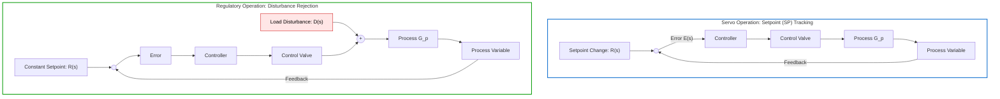

---

## 2. Inverting OP-AMP Proportional (P) Controller
* **File Name:** `opamp_p_controller.png`

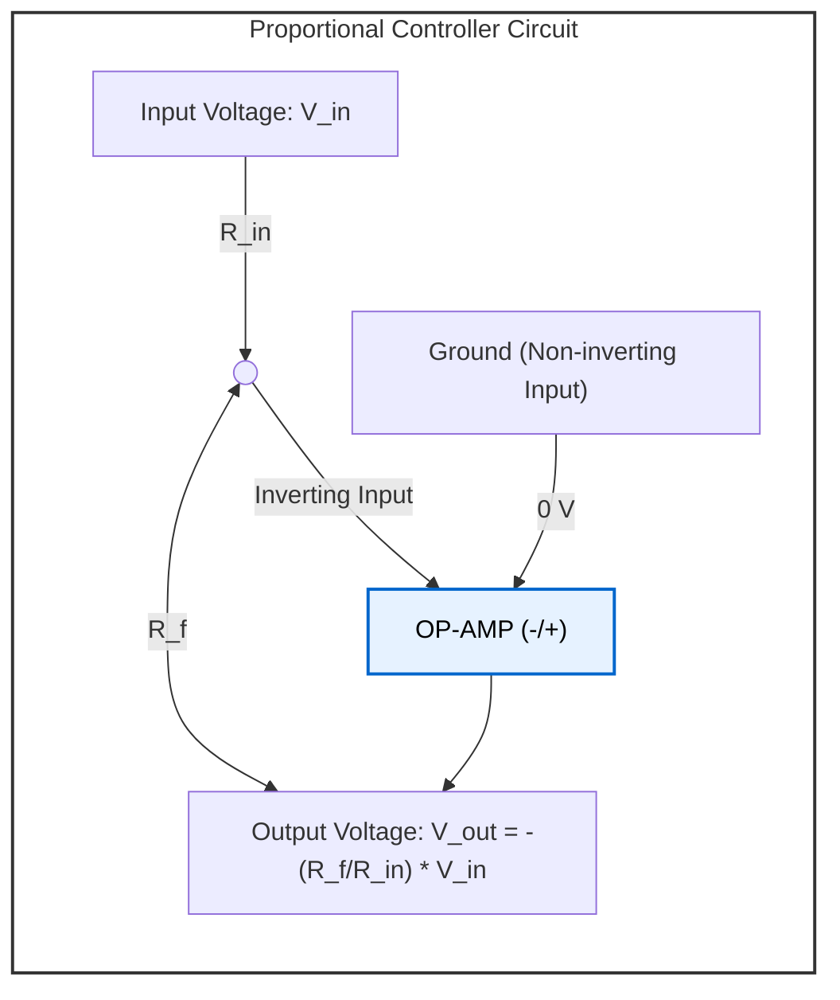

---

## 3. Integrating OP-AMP Integral (I) Controller
* **File Name:** `opamp_i_controller.png`

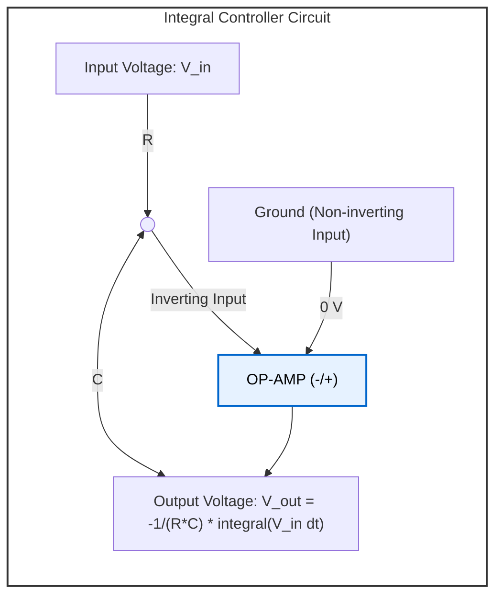

---

## 4. Differentiating OP-AMP Derivative (D) Controller
* **File Name:** `opamp_d_controller.png`

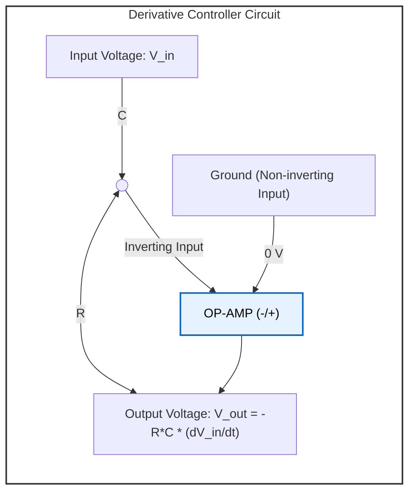

---

## 5. OP-AMP Proportional-Integral (PI) Controller
* **File Name:** `opamp_pi_controller.png`

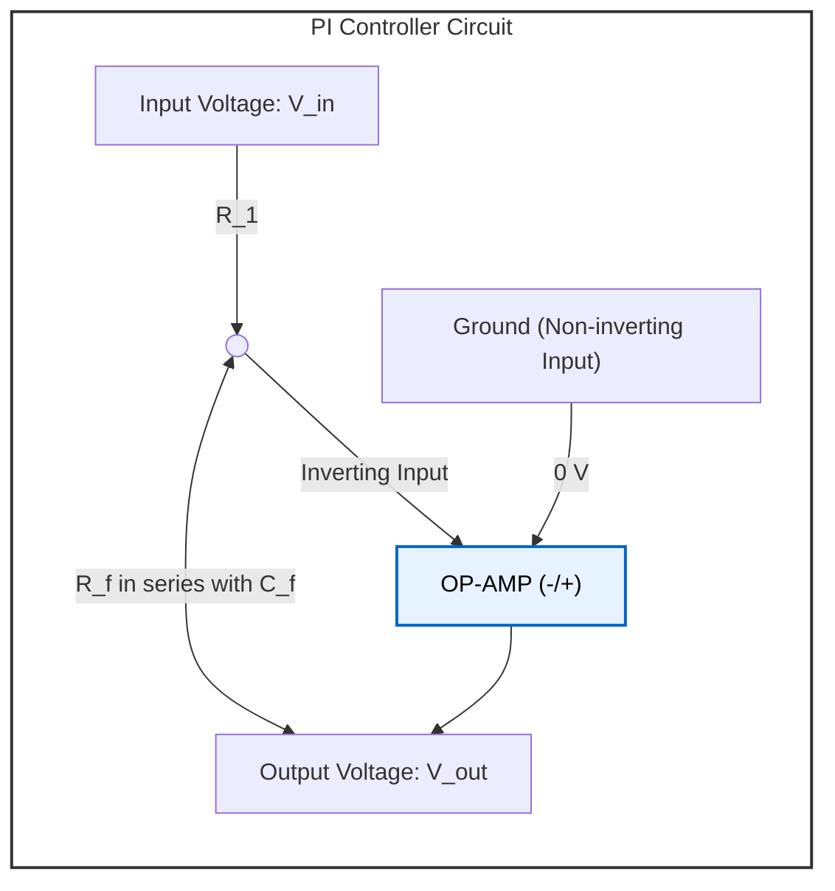

---

## 6. OP-AMP Proportional-Derivative (PD) Controller
* **File Name:** `opamp_pd_controller.png`

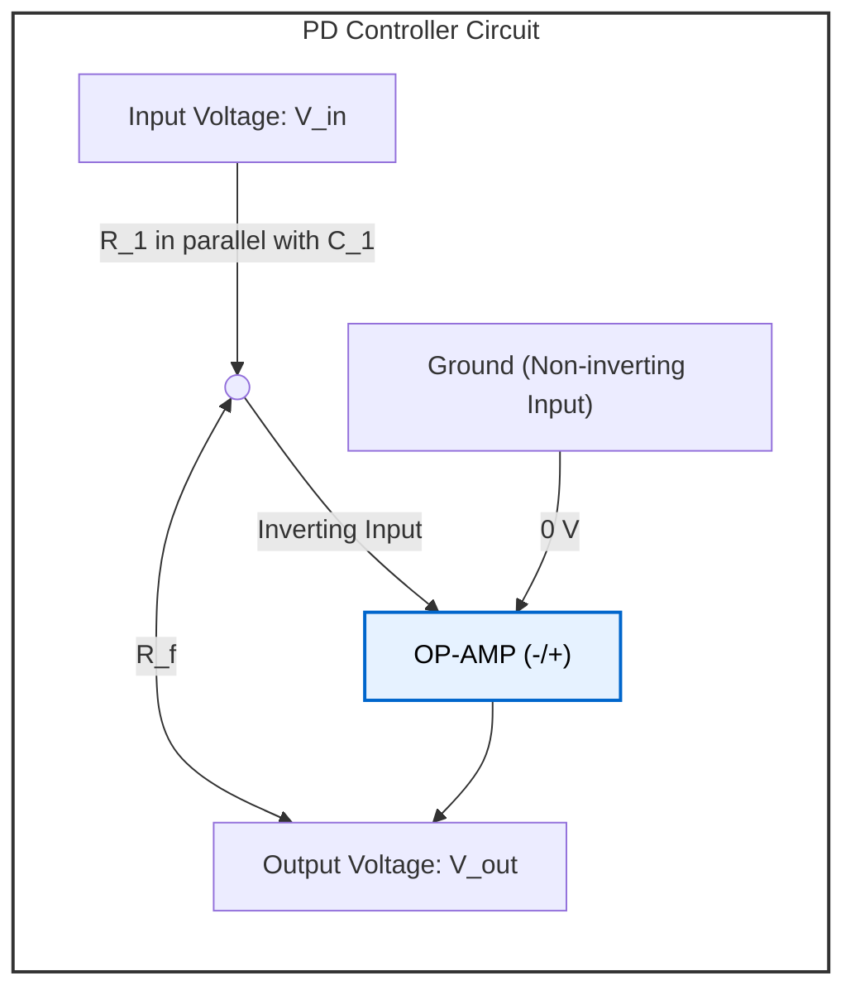

---

## 7. Parallel OP-AMP PID Controller
* **File Name:** `opamp_pid_parallel.png`

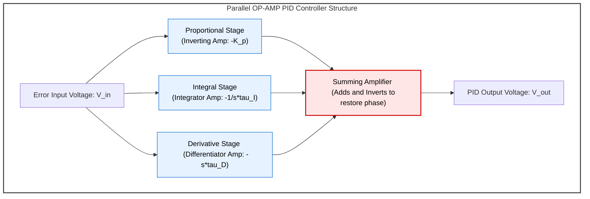

---

## 8. Pneumatic PID Controller Architecture
* **File Name:** `pneumatic_pid.png`

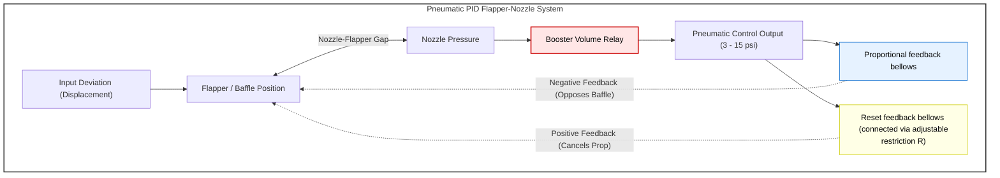

---

## 9. Ziegler-Nichols Process Reaction Curve (Open Loop)
* **File Name:** `zn_open_loop.png`

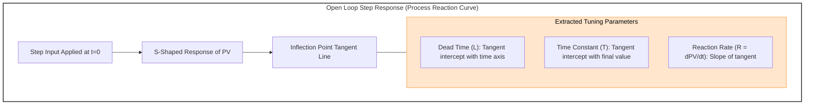

---

## 10. Ziegler-Nichols Ultimate Gain Method (Closed Loop)
* **File Name:** `zn_closed_loop.png`

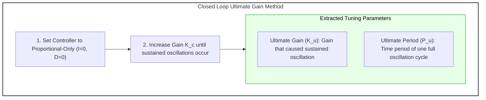

---

## 11. Quarter-Amplitude Decay Waveform
* **File Name:** `quarter_decay.png`

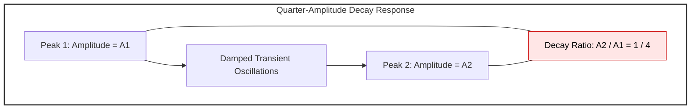

---

## 12. Parallel PID Control Loop Block Diagram
* **File Name:** `pid_block_diagram.png`

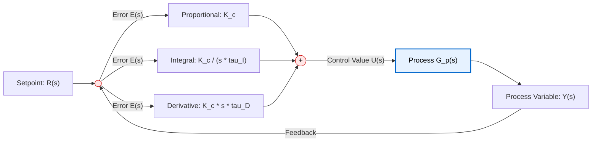
