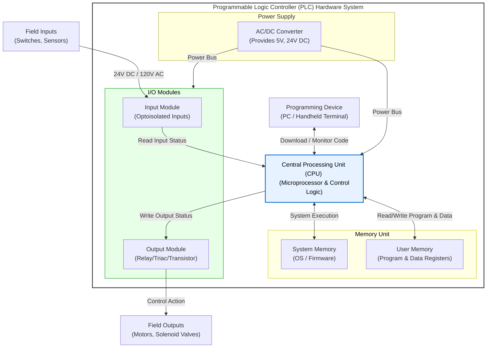
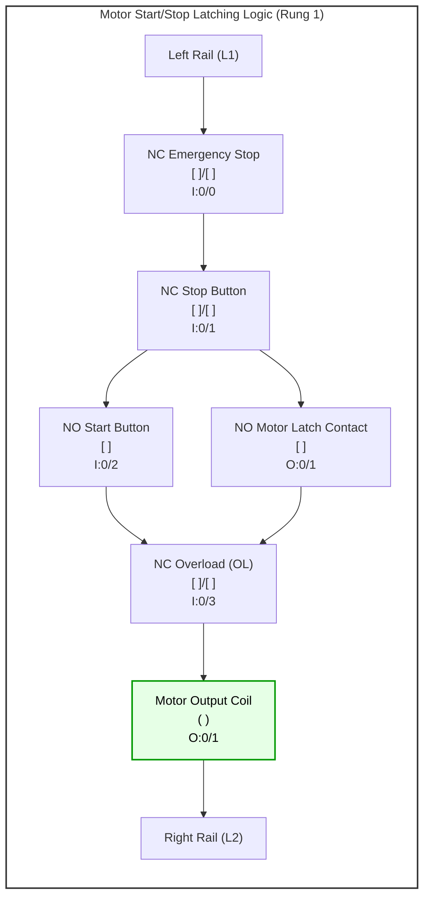
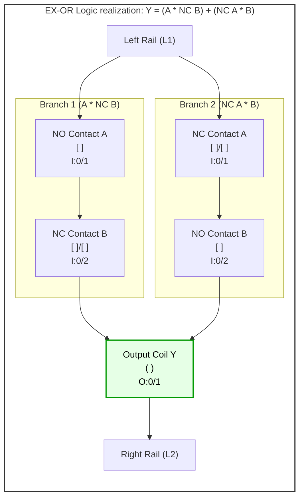
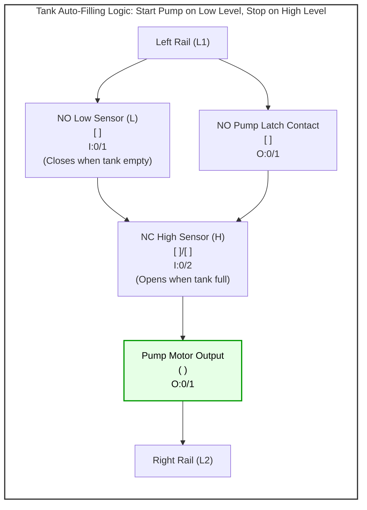
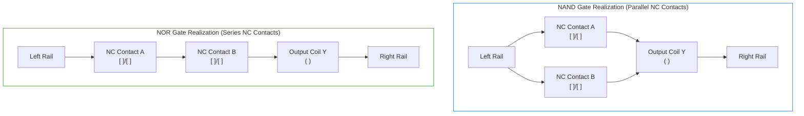
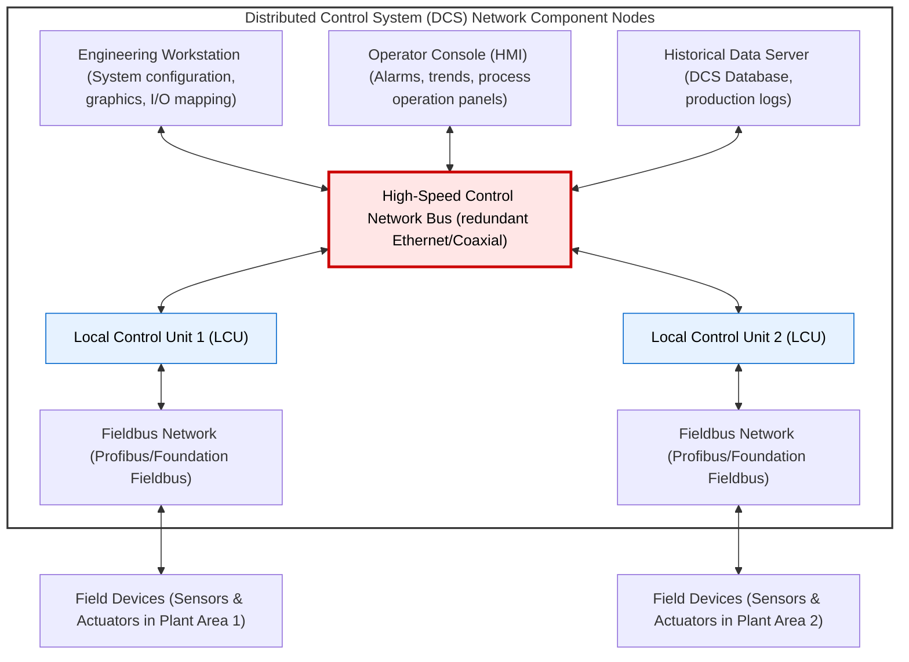
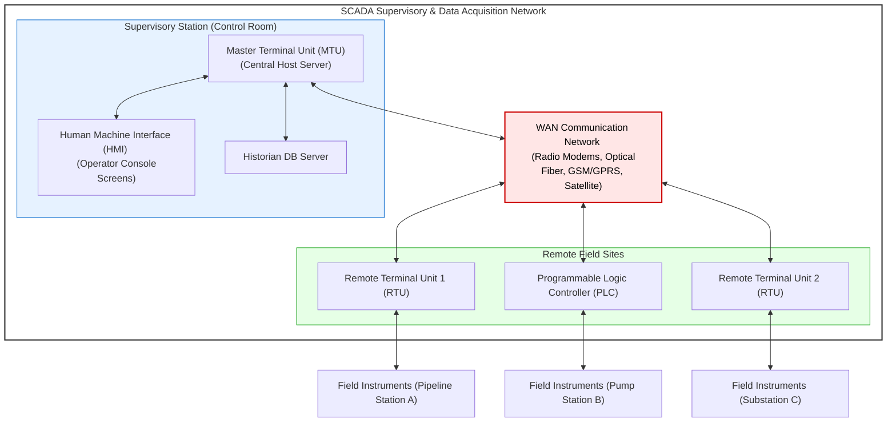
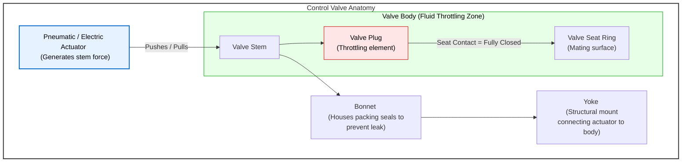
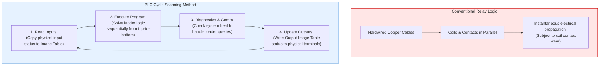

# Chapter 3 Diagrams: Automation Systems

This file contains the Mermaid diagram codes for Chapter 3. These codes can be rendered in the Mermaid Editor (local or online) to export high-quality PNGs to this directory.

---

## 1. PLC Hardware Architecture Block Diagram
* **File Name:** `plc_architecture.png`

---

## 2. PLC Motor Start/Stop Latching Control (Ladder Logic)
* **File Name:** `motor_latch.png`

---

## 3. PLC EX-OR Gate Implementation (Ladder Logic)
* **File Name:** `xor_ladder.png`

---

## 4. PLC Tank Level Control System (Ladder Logic)
* **File Name:** `tank_level_ladder.png`

---

## 5. PLC NAND & NOR Logic Gate Realizations
* **File Name:** `nand_nor_gates.png`

---

## 6. Distributed Control System (DCS) Hierarchical Levels
* **File Name:** `dcs_hierarchy.png`

```mermaid
graph TD
    subgraph DCS_Hierarchy ["Distributed Control System (DCS) Levels"]
        L4["Level 4: Enterprise Level <br> (ERP, Business Planning, Long-term Scheduler)"]
        L3["Level 3: Operations & Management Level <br> (MES, Database Server, Production Reports)"]
        L2["Level 2: Supervisory & Console Level <br> (HMI Stations, Operator Desks, Engineering PC)"]
        L1["Level 1: Direct Control Level <br> (Distributed LCUs, PLCs, Controller Units)"]
        L0["Level 0: Field Level <br> (Sensors, Actuators, Smart Instruments, Valves)"]
    end
    
    L4 --> L3
    L3 --> L2
    L2 --> L1
    L1 --> L0
    L0 -->|Raw Data / Feedback| L1
    L1 -->|Status Updates| L2
    L2 -->|Aggregated Logs| L3
    L3 -->|Business Analytics| L4

    style DCS_Hierarchy fill:none,stroke:#333,stroke-width:2px
    style L4 fill:#f2f2f2,stroke:#666,color:#000
    style L3 fill:#ffffe6,stroke:#cccc00,color:#000
    style L2 fill:#e6f2ff,stroke:#0066cc,color:#000
    style L1 fill:#e6ffe6,stroke:#009900,color:#000
    style L0 fill:#ffe6e6,stroke:#cc0000,color:#000
```

---

## 7. DCS Functional Block Architecture
* **File Name:** `dcs_architecture.png`

---

## 8. SCADA System Topology Block Diagram
* **File Name:** `scada_architecture.png`

---

## 9. Control Valve Structural Component Assembly
* **File Name:** `control_valve.png`

---

## 10. Electromagnetic Relay Panel vs. PLC Scan Cycle
* **File Name:** `relay_vs_plc.png`

