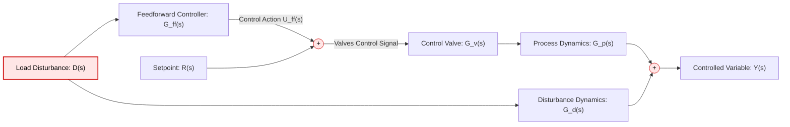
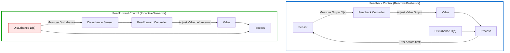
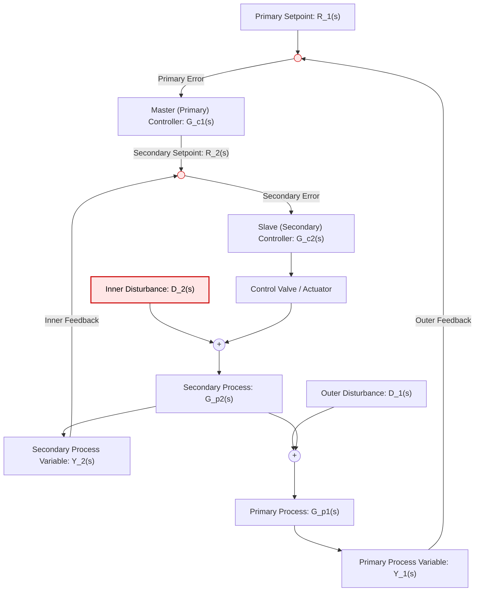
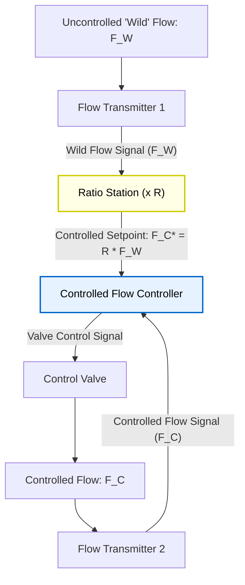
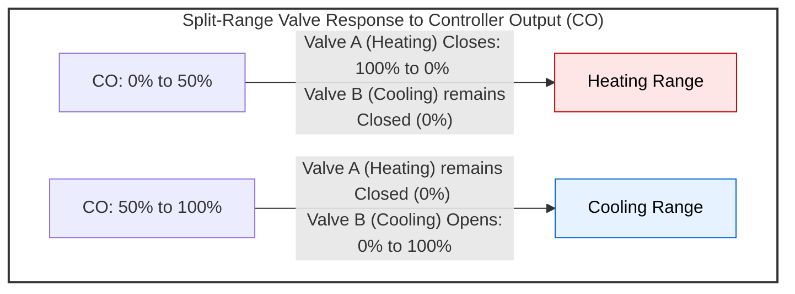
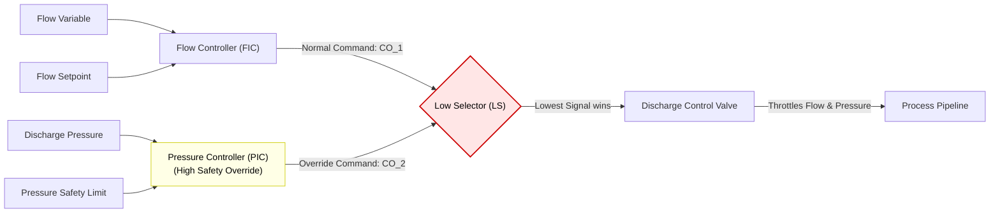
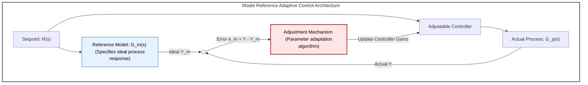
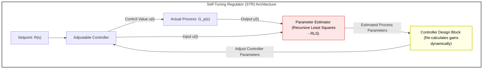
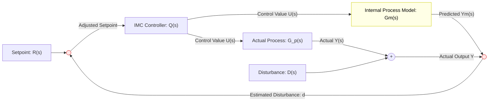

# Chapter 4 Diagrams: Advanced Control Techniques

This file contains the Mermaid diagram codes for Chapter 4. These codes can be rendered in the Mermaid Editor (local or online) to export high-quality PNGs to this directory.

---

## 1. Feedforward Control System Block Diagram
* **File Name:** `feedforward_block.png`

---

## 2. Feedback vs. Feedforward Control Loop Comparison
* **File Name:** `feedback_vs_feedforward.png`

---

## 3. Cascade Control Loop Block Diagram
* **File Name:** `cascade_block.png`

---

## 4. Ratio Control System (Multiplier Scheme)
* **File Name:** `ratio_control.png`

---

## 5. Split-Range (Duplex) Control Loop Graph
* **File Name:** `split_range.png`

---

## 6. Override (Selective) Control Loop
* **File Name:** `override_control.png`

---

## 7. Model Reference Adaptive Control (MRAC)
* **File Name:** `mrac_block.png`

---

## 8. Self-Tuning Regulator (STR)
* **File Name:** `str_block.png`

---

## 9. Internal Model Control (IMC) Block Diagram
* **File Name:** `imc_block.png`

