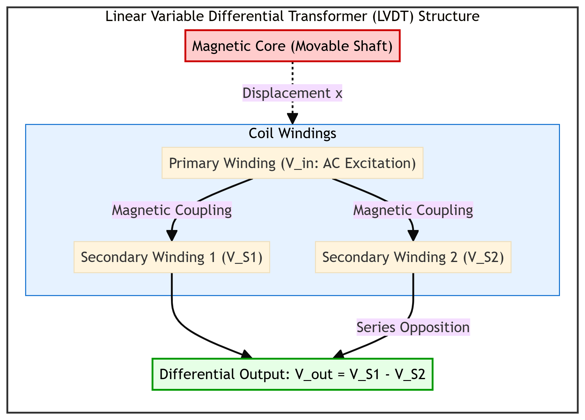
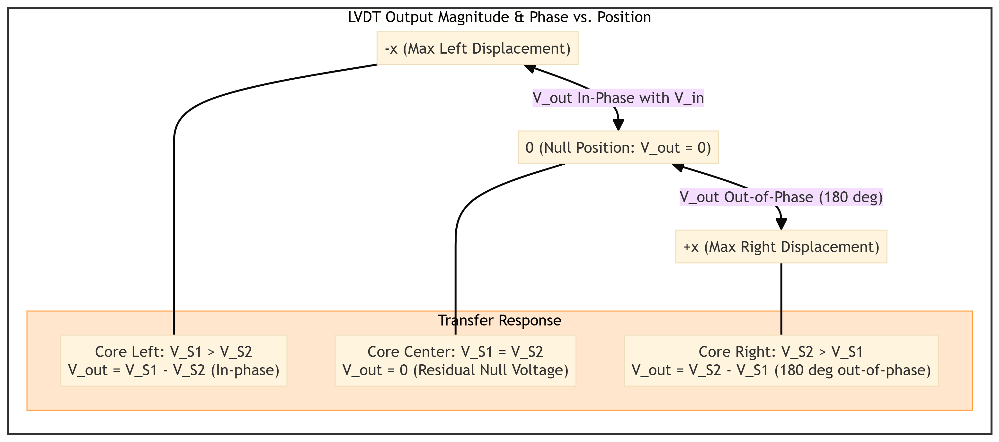
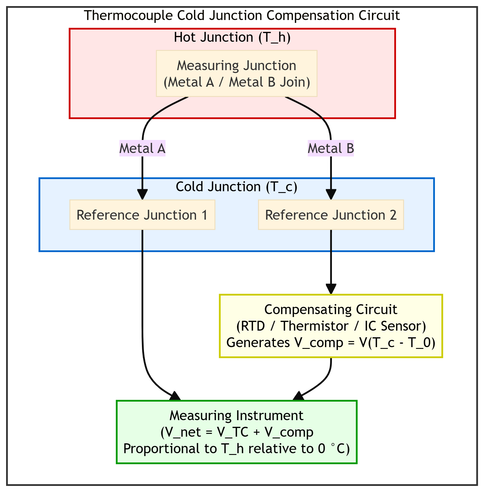
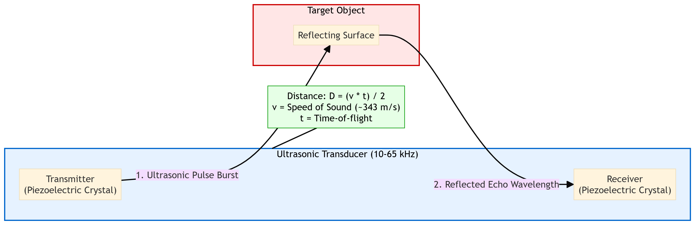
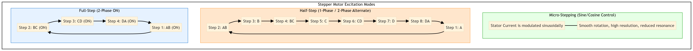
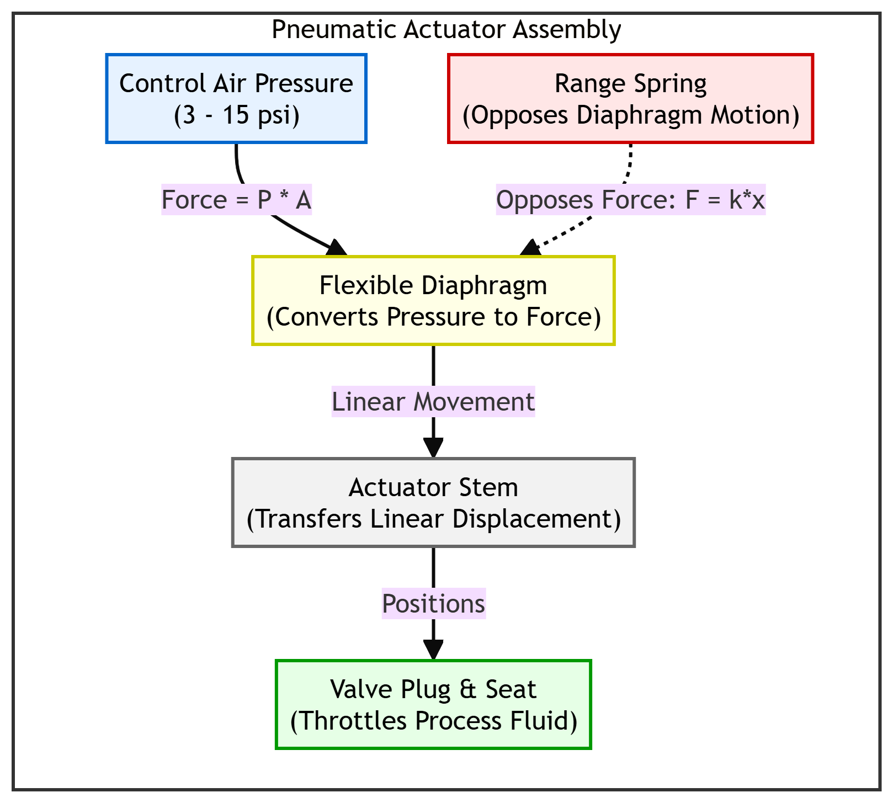
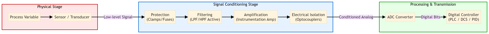
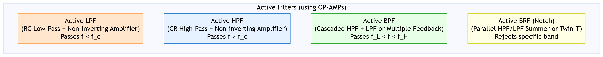
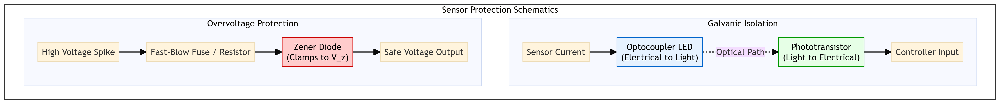
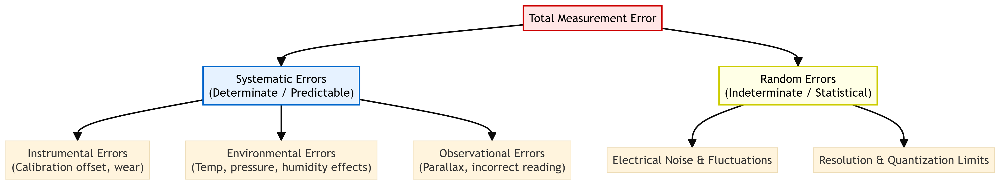

# Chapter 1: Sensors, Actuators & Signal Conditioning

This chapter compiles lecture-quality study notes and comprehensive exam answers for **Unit I: Sensors & Actuators** of the PE-EC802B syllabus, adhering strictly to the **MAKAUT Answer Writing Guidelines** and **LaTeX Compatibility Rules**.

---

## Section 1: Industrial Sensors [15M] [Priority: High]

### 1. Transducers: Active vs. Passive
A **transducer** is a physical device that converts energy from one form to another, typically converting a non-electrical physical parameter (e.g., temperature, pressure, displacement) into an electrical signal (e.g., voltage, current, resistance).

| Feature / Criteria | Active Transducers | Passive Transducers |
| :--- | :--- | :--- |
| **Power Requirement** | Self-generating; do not require any external electrical source. | Externally powered; require an auxiliary AC/DC source. |
| **Operating Principle** | Convert physical energy directly to electrical energy. | Cause a change in electrical parameters (R, L, or C). |
| **Signal Source** | Draw energy from the process under measurement. | Draw energy from the external auxiliary source. |
| **Output Type** | Analog voltage or current signals (e.g., mV, pA). | Parameter variation (e.g., $\Delta R$, $\Delta L$, $\Delta C$). |
| **Examples** | Thermocouple, Piezoelectric crystal, Solar cell. | RTD, LVDT, Strain gauge, Thermistor. |

---

### 2. Linear Variable Differential Transformer (LVDT)
The **Linear Variable Differential Transformer (LVDT)** is a passive inductive transducer used to measure linear displacement with high resolution and accuracy.

#### A. Construction & Operating Principle
An LVDT consists of a single primary winding ($P$) and two secondary windings ($S_1$ and $S_2$) wound symmetrically on a hollow cylindrical coil form. A highly permeable ferromagnetic core is placed inside the cylinder and attached to the moving element whose displacement is to be measured.

The primary winding is excited by an alternating current (AC) voltage source:
$$V_{in} = V_p \sin(\omega t)$$

This excitation creates an alternating magnetic field that induces voltages in both secondary windings through mutual inductance. The two secondary windings are connected in **series opposition**, meaning their output voltages oppose each other. The net differential output voltage ($V_{out}$) is:
$$V_{out} = V_{S1} - V_{S2}$$

#### B. Electro-Mechanical Transfer Characteristics
The position of the core determines the mutual inductance between the primary and each secondary winding:

1. **Null Position (Core at Center):** The core is symmetrically placed. The magnetic coupling to both secondary windings is identical, meaning $V_{S1} = V_{S2}$. Thus, the differential output voltage is:
   $$V_{out} = 0\ \text{V}$$
   *(Note: In practice, a small residual null voltage exists due to stray capacitances and harmonic frequencies).*
2. **Left Displacement (-x):** The core shifts toward $S_1$. The magnetic coupling to $S_1$ increases while coupling to $S_2$ decreases, resulting in $V_{S1} > V_{S2}$. The output voltage is in-phase with the primary voltage.
3. **Right Displacement (+x):** The core shifts toward $S_2$. The magnetic coupling to $S_2$ increases while coupling to $S_1$ decreases, resulting in $V_{S2} > V_{S1}$. The output voltage is $180^\circ$ out-of-phase with the primary voltage.

#### C. Advantages & Disadvantages
- **Advantages:**
  - **Infinite Resolution:** Linear movement produces a continuous, infinite-resolution output signal.
  - **Low Friction & Wear:** No physical electrical contact between the core and the coil assembly.
  - **Ruggedness:** Capable of surviving extreme shock, vibration, and environmental contamination.
  - **Low Hysteresis:** Highly repeatable displacement measurements.
- **Disadvantages:**
  - **Magnetic Interference:** Vulnerable to external stray magnetic fields; requires magnetic shielding.
  - **Temperature Sensitivity:** Changes in temperature alter the coil resistance and magnetic properties of the core.
  - **AC Source Required:** Demodulator circuitry is needed to convert the AC output to a DC signal.

---

### 3. Temperature Sensors
Industrial temperature measurement uses different transducers depending on the temperature range, sensitivity, and linearity required.

#### A. Thermocouples
A **thermocouple** is an active temperature transducer based on the **Seebeck Effect**: when two dissimilar metal conductors are joined at two junctions held at different temperatures ($T_{hot}$ and $T_{cold}$), an electromotive force (EMF) is generated that is proportional to the temperature difference:
$$E = a(T_{hot} - T_{cold}) + b(T_{hot} - T_{cold})^2$$
where $a$ and $b$ are constants related to the thermocouple metals.

**Common Thermocouple Types:**
1. **Type K (Chromel / Alumel):**
   - *Composition:* Nickel-Chromium (+) and Nickel-Aluminum (-).
   - *Temperature Range:* $-200^\circ\text{C}$ to $+1372^\circ\text{C}$.
   - *Application:* Widely used due to its oxidation resistance at high temperatures.
2. **Type J (Iron / Constantan):**
   - *Composition:* Iron (+) and Copper-Nickel (-).
   - *Temperature Range:* $-40^\circ\text{C}$ to $+750^\circ\text{C}$.
   - *Application:* Suitable for vacuum or reducing atmospheres.

**Cold Junction Compensation (CJC):**
Thermocouple tables are calibrated with the reference (cold) junction at $0^\circ\text{C}$. In industrial applications, the cold junction is at the ambient temperature of the control panel ($T_c$). To measure the absolute hot junction temperature ($T_h$), **Cold Junction Compensation** is applied:
1. The ambient temperature ($T_c$) is measured using a local sensor (e.g., RTD or thermistor).
2. A compensating voltage $V_{comp}$ corresponding to the thermocouple's output at $T_c$ relative to $0^\circ\text{C}$ is calculated.
3. This voltage is added to the raw thermocouple voltage ($V_{raw}$) to determine the true temperature:
   $$V_{net} = V_{raw} + V_{comp}$$

#### B. RTD (Resistance Temperature Detector)
An **RTD** is a passive sensor whose resistance increases linearly with temperature (Positive Temperature Coefficient, PTC). The relationship is governed by:
$$R_T = R_0 [1 + \alpha(T - T_0)]$$
where $R_0$ is the resistance at reference temperature $T_0$, and $\alpha$ is the temperature coefficient of resistance.
- *Material:* Platinum (PT100 has a nominal resistance of $100\ \Omega$ at $0^\circ\text{C}$).
- *Pros & Cons:* Highly stable, accurate, and linear; but has slow response time and is subject to self-heating errors.

#### C. Thermistors
A **thermistor** is a semiconductor temperature sensor that exhibits a highly non-linear resistance change with temperature, typically possessing a Negative Temperature Coefficient (NTC).
- *Formula (Steinhart-Hart Equation):*
  $$\frac{1}{T} = A + B \ln(R) + C (\ln(R))^3$$
- *Pros & Cons:* Extremely sensitive and fast-acting; but highly non-linear with a limited temperature range.

#### D. Pressure Thermometer
A **pressure thermometer** is a filled-system thermometer that measures temperature by detecting the thermal expansion of a working fluid.
- *Operation:* A bulb containing a liquid, gas, or vapor is placed in the thermal zone. As temperature rises, the fluid expands, creating a pressure increase. This pressure is transmitted via a capillary tube to an elastic pressure sensing element (such as a Bourdon tube or bellows), which mechanically moves a pointer or electronic transmitter.

---

### 4. Pressure Sensors
Industrial pressure measurement relies on elastic sensing elements that deform under applied pressure, transferring this mechanical movement to electrical transducers.

1. **Diaphragm:** A thin, flexible circular plate that deflects under pressure. Diaphragms are used for low-pressure measurements and are often coupled with strain gauges or capacitive sensors to convert deflection into electrical signals.
2. **Bellows:** Thin-walled metallic cylinders with deep convolutions. When pressure is applied internally, the bellows expands axially, acting as a spring. It provides a larger mechanical displacement than a diaphragm and is ideal for medium pressure ranges.
3. **Bourdon Tube:** A C-shaped, helical, or spiral tube of oval cross-section. When pressurized internally, the tube tends to straighten out. The free end of the tube moves in proportion to the applied pressure, which is mechanically linked to a pointer or electronic potentiometer.

---

### 5. Force Sensors & Strain Gauges
A **strain gauge** is a passive resistive sensor used to measure mechanical strain (deformation).

#### A. Working Principle & Gauge Factor Derivation
When a metallic wire is subjected to mechanical tension, its length ($L$) increases, its cross-sectional area ($A$) decreases, and its resistivity ($\rho$) changes due to piezoresistive effects. The resistance of the wire is:
$$R = \frac{\rho L}{A}$$

Taking the natural logarithm and differentiating yields:
$$\frac{dR}{R} = \frac{dL}{L} - \frac{dA}{A} + \frac{d\rho}{\rho}$$

Since the cross-sectional area of a wire with diameter $D$ is $A = \pi D^2 / 4$, we have $\frac{dA}{A} = 2 \frac{dD}{D}$. Substituting this gives:
$$\frac{dR}{R} = \frac{dL}{L} - 2\frac{dD}{D} + \frac{d\rho}{\rho}$$

Poisson's ratio ($\nu$) is defined as the ratio of lateral strain to longitudinal strain:
$$\nu = -\frac{dD/D}{dL/L} \implies \frac{dD}{D} = -\nu \frac{dL}{L}$$

Substituting Poisson's ratio back into the equation:
$$\frac{dR}{R} = \frac{dL}{L} (1 + 2\nu) + \frac{d\rho}{\rho}$$

Dividing the entire equation by the longitudinal strain ($\epsilon = dL/L$) yields the **Gauge Factor (G)**, which represents the sensitivity of the strain gauge:
$$G = \frac{dR/R}{dL/L} = 1 + 2\nu + \frac{d\rho/\rho}{dL/L}$$
where:
* $1$: Change in resistance due to change in length.
* $2\nu$: Change in resistance due to change in area.
* $\frac{d\rho/\rho}{dL/L}$: Change in resistance due to the piezoresistive effect.

For metal wire strain gauges, $G$ is typically around $2.0$. For semiconductor strain gauges, the piezoresistive component is very large, yielding a gauge factor of $100\text{--}150$.

---

### 6. Ultrasonic Sensors
An **ultrasonic sensor** is a non-contact sensor used for distance measurement and object detection.

#### A. Working Principle
The sensor consists of a piezoelectric transmitter that emits high-frequency sound wave pulses (typically in the **10--65 kHz** range) and a receiver that waits for the reflected echo from the target object.

The distance ($D$) to the object is calculated based on the **Time-of-Flight (ToF)** of the sound wave:
$$D = \frac{v \times t}{2}$$
where:
* $v$: Speed of sound in air (approximately $343\ \text{m/s}$ at $20^\circ\text{C}$).
* $t$: Measured time delay between the transmission of the pulse and the reception of the echo.

#### B. Applications
- **Liquid Level Measurement:** Monitoring level in chemical tanks without physical contact, preventing corrosion issues.
- **Obstacle Avoidance:** Used in industrial automated guided vehicles (AGVs) and robotics.
- **Non-Destructive Testing (NDT):** Detecting internal cracks and voids in metallic structures.

---

## Section 2: Industrial Actuators [15M] [Priority: High]

An **actuator** is a device that converts an electrical, pneumatic, or hydraulic control signal into mechanical energy (motion) to manipulate a process.

---

### 1. DC Motors & Starters
A **DC motor** converts electrical direct current into mechanical rotation.

#### A. Back EMF and High Starting Current
When a DC motor rotates, its armature conductors cut the magnetic field lines, inducing an internal voltage called **Back EMF ($E_b$)** that opposes the applied terminal voltage ($V$):
$$E_b = \frac{\Phi Z N P}{60 A} = K_m \omega$$
where $N$ is motor speed.

The armature current ($I_a$) is governed by:
$$I_a = \frac{V - E_b}{R_a}$$
where $R_a$ is the armature winding resistance (typically very small, $< 1\ \Omega$).

At start-up, the motor speed is zero ($N = 0$), which means the Back EMF is also zero ($E_b = 0$). The starting current ($I_{start}$) is:
$$I_{start} = \frac{V}{R_a}$$

Because $R_a$ is extremely small, this starting current can be $5\text{--}10$ times larger than the rated full-load current. This high current can:
- Burn out the armature windings due to excessive $I^2 R_a$ heating.
- Cause severe sparking at the commutator and damage the brushes.
- Produce a voltage drop on the power supply line, affecting other connected equipment.

#### B. Need for Motor Starters
To prevent armature damage, a **motor starter** (such as a 3-point or 4-point starter) is connected in series with the armature. The starter inserts a variable resistance ($R_{start}$) into the armature circuit at boot to limit the starting current:
$$I_{start} = \frac{V}{R_a + R_{start}}$$

As the motor accelerates, the Back EMF ($E_b$) builds up. The starter mechanism gradually cuts out the starting resistors until the armature is connected directly across the supply line once the motor reaches operating speed.

---

### 2. Stepper Motors vs. Servo Motors
Both stepper and servo motors are used for precise position control in automation, but their operating principles and application areas differ significantly.

| Feature / Criteria | Stepper Motor | Servo Motor |
| :--- | :--- | :--- |
| **Control Loop** | Open-loop (no feedback sensor needed). | Closed-loop (requires encoder/resolver feedback). |
| **Positioning Method** | Moves in discrete, defined steps. | Continuous rotation guided by feedback error signals. |
| **Torque Profile** | High holding torque at standstill; falls off at high speeds. | Consistent torque output across the entire speed range. |
| **Overshooting** | No overshooting; locks into step position. | May overshoot slightly; relies on PID tuning to settle. |
| **Cost & Complexity** | Simple drive electronics; low cost. | Complex controller, encoder, and tuning; high cost. |

#### A. Stepper Motor Step Modes
A stepper motor rotates by sequentially energizing electromagnetic stator phases. The step resolution can be modified using different excitation modes:

1. **Full-Step (2-Phase ON):** Stator phases are energized in pairs. The motor moves through its basic step angle (e.g., $1.8^\circ$ per step), providing maximum torque.
2. **Half-Step:** Alternates between energizing one phase and two phases (e.g., A $\rightarrow$ AB $\rightarrow$ B $\rightarrow$ BC). This halves the step angle (e.g., $0.9^\circ$), doubling the positioning resolution and reducing vibrations.
3. **Micro-stepping:** The current supplied to the windings is modulated as sine and cosine waves. This allows the rotor to position itself between physical steps, yielding extremely high resolution, quiet operation, and smooth rotation at low speeds.

---

### 3. Piezoelectric Actuators
A **piezoelectric actuator** converts electrical energy directly into linear displacement using the **Inverse Piezoelectric Effect**: when an electric field is applied across a piezoelectric crystal (e.g., Lead Zirconate Titanate - PZT), the crystal lattice deforms, producing a mechanical displacement.

#### A. Types of Piezoelectric Actuators
- **Stack Actuators:** Consist of multiple piezoelectric disks stacked on top of each other in series mechanically and in parallel electrically. They produce high pushing forces (up to tens of kilonewtons) but have very short displacements (typically $< 100\ \mu\text{m}$).
- **Stripe (Bending) Actuators:** Consist of two thin piezoelectric strips bonded together. When voltage is applied, one strip expands while the other contracts, causing the assembly to bend. They produce larger displacements (millimeters) but much lower forces.

#### B. Pros & Cons
- **Advantages:** Sub-nanometer positioning resolution, fast response times (microseconds), and high force output.
- **Disadvantages:** Very short stroke length, significant hysteresis ($10\text{--}15\%$), and requires high driving voltages ($> 100\ \text{V}$).

---

### 4. Pneumatic Actuators
A **pneumatic actuator** uses compressed air to produce mechanical motion.

#### A. Spring-Diaphragm Actuator Working Principle
The most common control valve actuator is the spring-diaphragm actuator. It consists of a flexible diaphragm held within a metal casing, backed by a heavy range spring.

- **Operation:** Compressed air (typically an industrial standard **3--15 psi** signal) is introduced into the chamber on one side of the diaphragm. The pressure exerts a force ($F = P \times A_{diaphragm}$) that compresses the range spring. The actuator stem moves linearly in proportion to the air pressure.
- **Fail-Safe Action:**
  - **Air-to-Open (Fail-Closed):** Increasing pressure moves the stem downward to open the valve; loss of air pressure causes the spring to push the stem up, closing the valve.
  - **Air-to-Close (Fail-Open):** Increasing pressure closes the valve; loss of air pressure causes the spring to open it.

---

## Section 3: Signal Conditioning & Transmission [15M] [Priority: High]

### 1. Signal Conditioning System
**Signal conditioning** refers to the operations performed on raw sensor outputs to make them suitable for transmission, display, or analog-to-digital conversion.

#### Core Functions of the Block Diagram:
1. **Protection:** Guards downstream electronics against high-voltage transients or current spikes (e.g., using zener diodes, varistors, or fuses).
2. **Filtering:** Removes unwanted high-frequency noise or power line interference ($50\ \text{Hz}$) and prevents aliasing before digitization.
3. **Amplification:** Boosts low-voltage sensor outputs (such as mV-level thermocouple signals) to a standard range (e.g., $0\text{--}5\ \text{V}$ or $0\text{--}10\ \text{V}$) using high-performance instrumentation amplifiers.
4. **Isolation:** Breaks ground loops and protects the controller from high common-mode voltages by separating the sensor circuit from the controller circuit galvanically (using optocouplers or isolation transformers).
5. **Analog-to-Digital Conversion (ADC):** Converts the conditioned continuous analog voltage into a discrete digital representation for processing by microprocessors, PLCs, or DCS controllers.

---

### 2. Active Filter Design using OP-AMPs
Filters are used in signal conditioning to isolate specific frequency bands and suppress electrical noise. **Active filters** use operational amplifiers (OP-AMPs) combined with resistor-capacitor (RC) networks, offering high input impedance, low output impedance, and signal gain.

#### A. Active Low-Pass Filter (LPF)
An active LPF passes low-frequency signals and attenuates frequencies above a specific cut-off frequency ($f_c$).
- **Circuit:** A passive RC low-pass filter connected to the non-inverting input of an OP-AMP configured as a voltage amplifier.
- **Transfer Function:**
  $$H(s) = \frac{V_{out}(s)}{V_{in}(s)} = \frac{A_v}{1 + s R C}$$
  where $A_v = 1 + \frac{R_f}{R_1}$ is the passband voltage gain, and $s = j\omega$.
- **Cut-off Frequency:**
  $$f_c = \frac{1}{2\pi R C}$$

#### B. Active High-Pass Filter (HPF)
An active HPF passes high-frequency signals and blocks low-frequency signals below its cut-off frequency.
- **Circuit:** Created by swapping the resistor and capacitor in the LPF input network.
- **Transfer Function:**
  $$H(s) = \frac{A_v s R C}{1 + s R C}$$
- **Cut-off Frequency:**
  $$f_c = \frac{1}{2\pi R C}$$

#### C. Active Band-Pass Filter (BPF)
A BPF allows a specific range of frequencies to pass while attenuating all others.
- **Design:** Constructed by cascading an active HPF with a lower cut-off frequency ($f_{c1}$) followed by an active LPF with a higher cut-off frequency ($f_{c2}$):
  $$f_{c1} < f < f_{c2}$$

#### D. Active Band-Reject (Notch) Filter (BRF)
A BRF attenuates a specific narrow band of frequencies (e.g., $50\ \text{Hz}$ power line hum) while passing all other frequencies.
- **Design:** Designed by summing the outputs of an active LPF and an active HPF in parallel using a summing amplifier, or by implementing a Twin-T notch filter topology.

---

### 3. Sensor Protection Circuits
Protection circuits prevent industrial voltage transients, short circuits, and electrostatic discharges (ESD) from damaging expensive controller hardware.

- **Overvoltage Protection (Zener Clamp):** A Zener diode with breakdown voltage $V_z$ is placed in parallel with the sensor output line. If a voltage spike exceeds $V_z$, the Zener diode breaks down and shunts the excess current to ground, clamping the output voltage to a safe level. A fast-blow fuse or series resistor limits the maximum current.
- **Galvanic Isolation (Optocoupler):** Converts the electrical sensor signal into light using an LED, which is transmitted across an air gap to a phototransistor. Because there is no physical electrical connection between the input and output sides, voltage surges of up to several kilovolts on the sensor side cannot pass to the controller.

---

### 4. Noise Suppression & Signal Transmission
Industrial plants are filled with electromagnetic interference (EMI) from heavy machinery, motors, and switching circuits.

- **Twisted-Pair Cabling:** Twisting the signal and return wires together ensures that any induced electromagnetic noise affects both wires equally (common-mode noise). This noise can then be rejected downstream using differential amplifiers (high Common-Mode Rejection Ratio - CMRR).
- **Shielding:** Wrapping signal cables in a conductive metal foil or braided sheath grounded at a single point diverts electrostatic noise currents to ground.
- **4-20 mA Current Loop Transmission:** Sending signals as a current rather than a voltage makes the transmission immune to line resistance and voltage drops over long distances. A line break is easily detected because the minimum signal level is $4\ \text{mA}$ rather than $0\ \text{mA}$.

---

## Section 4: Estimation of Errors & Calibration [5M] [Priority: Medium]

---

### 1. Calibration
**Calibration** is the process of comparing the output of a measurement instrument against a known, traceable reference standard of higher accuracy under specified environmental conditions.
- **Importance:** Ensures measurement accuracy, establishes traceability to national standards, detects drift over time, and maintains safety compliance in process loops.

---

### 2. Error Classification
Measurement errors represent the difference between the measured value and the true value of a variable.

1. **Systematic (Determinate) Errors:** Consistent, predictable deviations that occur in one direction. They can be identified and corrected through calibration or compensation.
   - *Instrumental:* Zero offset, worn components, or bad calibration.
   - *Environmental:* Changes in ambient temperature, pressure, or humidity that affect the sensor.
   - *Observational:* Parallax errors when reading analog meters.
2. **Random (Indeterminate) Errors:** Unpredictable, fluctuating deviations caused by random noise or minor environmental variations. They cannot be eliminated but can be analyzed and reduced statistically by taking multiple measurements and calculating the mean.

---

### 3. Limiting Error (Uncertainty Propagation)
The **limiting error** (or guarantee error) is the maximum deviation from the nominal value specified by the manufacturer. When multiple measured parameters with individual limiting errors are combined to calculate a system result, the total limiting error propagates.

Let $x_1$ and $x_2$ be two independent variables with limiting errors $\Delta x_1$ and $\Delta x_2$ (relative limiting errors $\delta_1 = \Delta x_1 / x_1$ and $\delta_2 = \Delta x_2 / x_2$).

#### A. Summation or Subtraction
Let the calculated result be:
$$X = x_1 \pm x_2$$

Differentiating the equation:
$$dX = dx_1 \pm dx_2$$

To find the worst-case maximum limiting error ($\Delta X$), we sum the absolute values of the individual errors:
$$\Delta X = \Delta x_1 + \Delta x_2$$

The absolute limiting error of a sum or difference is the **sum of the absolute limiting errors** of the individual components.

#### B. Multiplication or Division
Let the calculated result be:
$$X = x_1 \cdot x_2 \quad \text{or} \quad X = \frac{x_1}{x_2}$$

Taking the natural logarithm and differentiating:
$$\ln(X) = \ln(x_1) \pm \ln(x_2) \implies \frac{dX}{X} = \frac{dx_1}{x_1} \pm \frac{dx_2}{x_2}$$

To find the worst-case maximum relative limiting error, we sum the absolute values of the relative errors:
$$\frac{\Delta X}{X} = \frac{\Delta x_1}{x_1} + \frac{\Delta x_2}{x_2}$$

The relative limiting error of a product or quotient is the **sum of the relative limiting errors** of the individual components.
