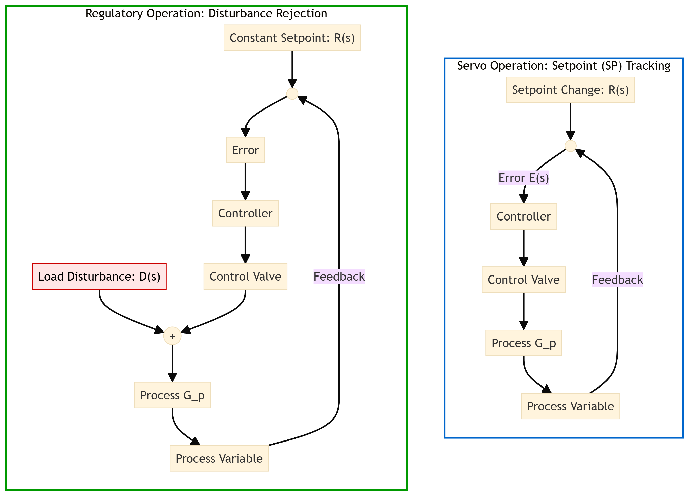
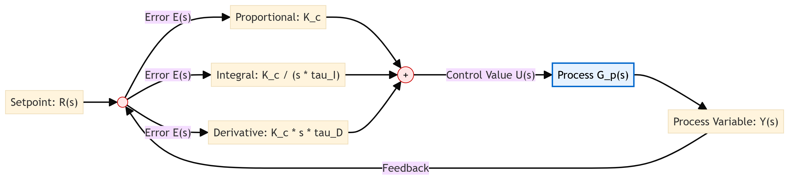
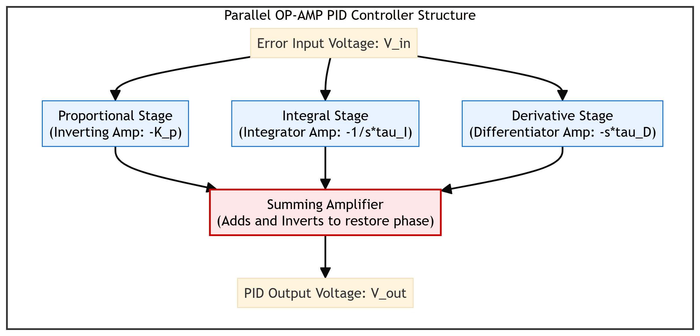
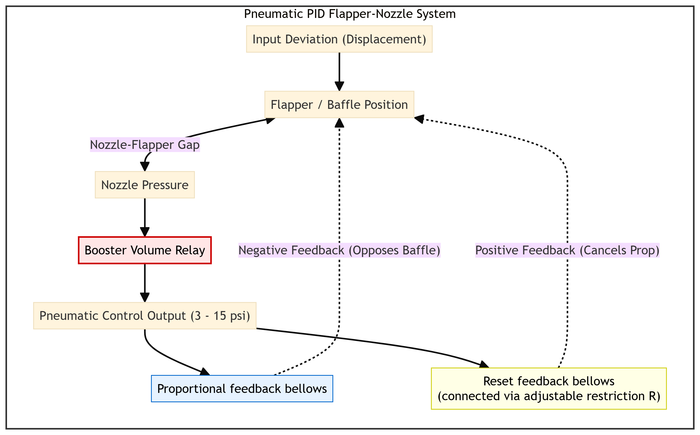
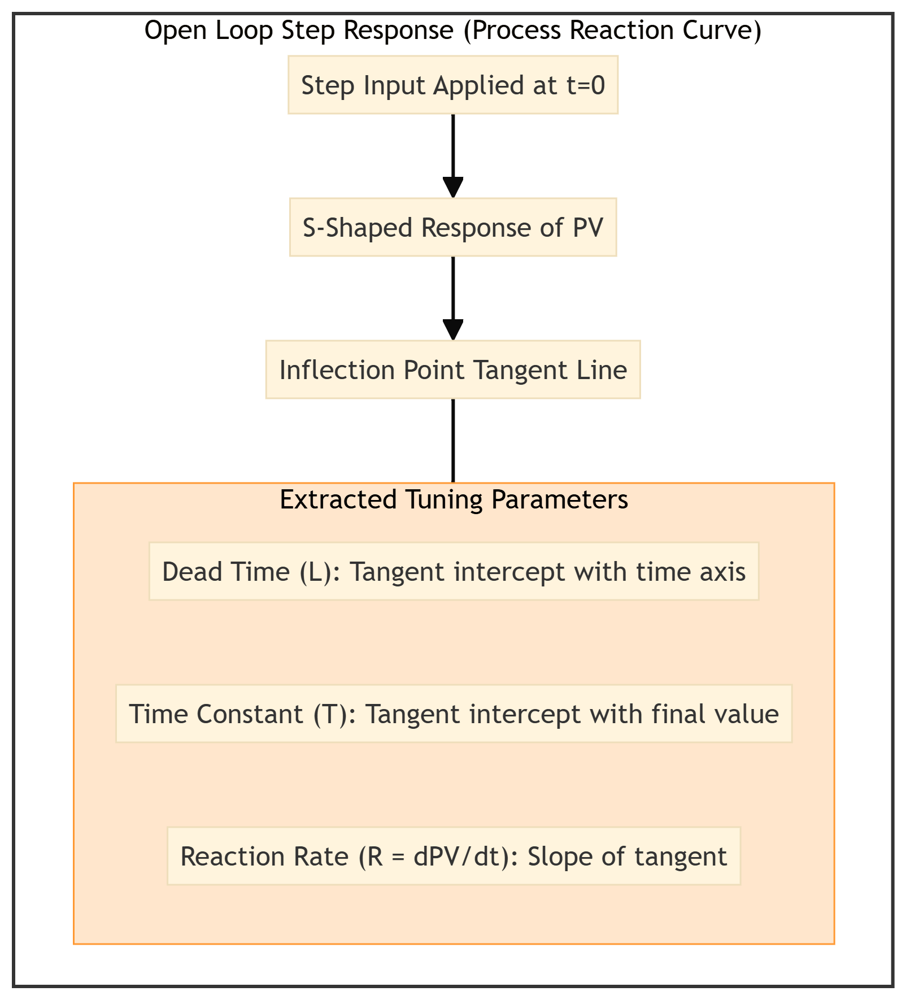
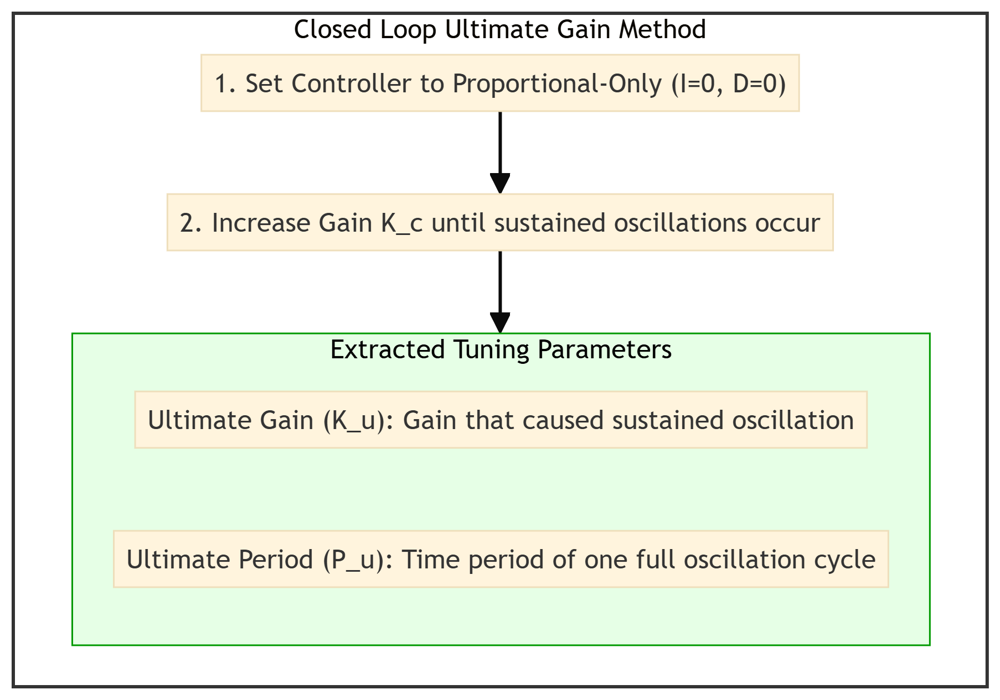

# Chapter 2: Controller Tuning & Implementation

This chapter compiles lecture-quality study notes and comprehensive exam answers for **Unit II: Controller Tuning** of the PE-EC802B syllabus, adhering strictly to the **MAKAUT Answer Writing Guidelines** and **LaTeX Compatibility Rules**.

---

## Section 1: Process Control Operations & Modes [5M] [Priority: Medium]

### 1. Servo vs. Regulatory Operations
Process control loops are designed to maintain a controlled variable at a desired value (setpoint) despite environmental variations. Depending on the source of the excitation, process control operations are divided into two main categories:

| Feature / Criteria | Servo Operation (Setpoint Tracking) | Regulatory Operation (Disturbance Rejection) |
| :--- | :--- | :--- |
| **Core Objective** | Keep the process variable equal to a dynamically changing setpoint. | Keep the process variable constant at a fixed setpoint despite load disturbances. |
| **Primary Input Change** | Setpoint ($R(s)$) changes; Load Disturbance ($D(s)$) remains constant. | Load Disturbance ($D(s)$) changes; Setpoint ($R(s)$) remains constant. |
| **Industrial Example** | Changing the temperature setpoint of a furnace during a heat treatment cycle. | Maintaining a constant product temperature in a heat exchanger despite fluctuations in inlet flow. |
| **Response Characteristic** | Fast tracking of the setpoint path with minimal overshoot and lag. | Fast return to the steady-state setpoint after a disturbance deflection. |

---

### 2. Self-Regulating vs. Non-Self-Regulating Systems
- **Self-Regulating Systems:** A process that naturally finds a new steady-state equilibrium following a step change in input without any controller intervention.
  - *Example:* A liquid storage tank with gravity-driven outflow. If the inlet flow rate ($F_{in}$) is stepped up, the liquid level ($h$) rises. As the level rises, the hydrostatic pressure increases, which drives a faster outflow rate ($F_{out}$). The level continues to rise until $F_{out} = F_{in}$, reaching a new stable level equilibrium.
- **Non-Self-Regulating (Integrating) Systems:** A process that does not reach a new equilibrium after a step input change but instead continuously ramps or drifts until it hits a physical limit (saturation).
  - *Example:* A liquid storage tank with a constant displacement pump at the outflow. If the inlet flow ($F_{in}$) is stepped up to exceed the fixed outflow pump capacity, the liquid level will continuously ramp upward until the tank overflows.

---

### 3. Process Dynamics: Dead-Time Element
**Dead-time (or transport lag)** is the time delay between the application of an input signal and the first observable change in the process variable. It is common in industrial systems involving material transport (e.g., fluid flow through pipes, conveyor belts).

- **Laplace Transfer Function:**
  $$G(s) = e^{-s T_d}$$
  where $T_d$ is the dead-time delay.
- **Padé Approximation:**
  Because the exponential term $e^{-s T_d}$ is non-rational, it is difficult to analyze in standard transfer function calculations. A first-order Padé approximation is commonly used:
  $$e^{-s T_d} \approx \frac{1 - \frac{T_d}{2} s}{1 + \frac{T_d}{2} s}$$

---

## Section 2: Controller Modes [15M] [Priority: High]

A controller detects the error between the Setpoint (SP) and the Process Variable (PV) and calculates a control output to adjust the final control element (valve).

$$e(t) = SP(t) - PV(t)$$

---

### 1. Proportional (P) Controller
The controller output ($p(t)$) is directly proportional to the error signal ($e(t)$).
- **Equation:**
  $$p(t) = K_c e(t) + p_0$$
  where $K_c$ is the Proportional Gain, and $p_0$ is the bias (controller output when error is zero).
- **Proportional Band (PB):**
  The range of error input that causes the controller output to shift from $0\%$ to $100\%$.
  $$PB = \frac{100}{K_c}\%$$
- **Characteristics:**
  - A very wide PB (low $K_c$) results in a slow, sluggish response.
  - A narrow PB (high $K_c$) makes the system faster but increases oscillation.
  - **Steady-State Offset:** A proportional controller always exhibits a steady-state error (offset) following a load change because a non-zero error is required to sustain a controller output other than $p_0$.

---

### 2. Integral (I) Controller
The controller output is proportional to the accumulation of the error signal over time.
- **Equation:**
  $$p(t) = \frac{1}{\tau_I} \int_0^t e(t') dt' + p_0$$
  where $\tau_I$ is the integral (reset) time. The reset rate is defined as $1/\tau_I$ (repeats per minute).
- **Characteristics:**
  - **Offset Elimination:** Since the controller output continues to change as long as any error exists, the integral mode completely eliminates steady-state offset.
  - **Sluggishness:** The integral action introduces a $-90^\circ$ phase lag, which slows down the transient response and can destabilize the loop.
  - **Reset Windup:** If a large error persists for a long time (e.g., during start-up or valve saturation), the integrator continues to accumulate error, driving the controller output to its limit. The system will experience heavy overshoot as the controller takes time to "unwind" the accumulated value.

---

### 3. Derivative (D) Controller
The controller output is proportional to the rate of change of the error signal.
- **Equation:**
  $$p(t) = \tau_D \frac{de(t)}{dt}$$
  where $\tau_D$ is the derivative (rate) time.
- **Characteristics:**
  - **Anticipatory Action:** By looking at the slope of the error, the derivative mode predicts where the process is heading and applies early corrective action, reducing overshoot and settling time.
  - **Steady-State Limitation:** If the error is constant (non-zero but flat), the derivative output is zero. Thus, it cannot eliminate steady-state offset on its own.
  - **Noise Amplification:** High-frequency measurement noise (small amplitude but very high rate of change) is heavily amplified by the derivative term, causing control valve wear.

---

### 4. Composite Controller Modes (PI, PD, PID)
To combine the speed of proportional, the offset elimination of integral, and the stabilization of derivative, composite controller modes are used:

- **Proportional-Integral (PI) Controller:**
  - *Equation:*
    $$p(t) = K_c \left[ e(t) + \frac{1}{\tau_I} \int_0^t e(t') dt' \right] + p_0$$
  - *Characteristics:* Eliminates steady-state offset and improves steady-state accuracy, but introduces a phase lag that slows down the transient settling time.
- **Proportional-Derivative (PD) Controller:**
  - *Equation:*
    $$p(t) = K_c \left[ e(t) + \tau_D \frac{de(t)}{dt} \right] + p_0$$
  - *Characteristics:* Increases system damping, reduces overshoot, and accelerates the transient response, but cannot eliminate steady-state offset.
- **Proportional-Integral-Derivative (PID) Controller:**
  - *Equation:*
    $$p(t) = K_c \left[ e(t) + \frac{1}{\tau_I} \int_0^t e(t') dt' + \tau_D \frac{de(t)}{dt} \right] + p_0$$
  - *Transfer Function (Parallel Form):*
    $$G_c(s) = K_c \left[ 1 + \frac{1}{\tau_I s} + \tau_D s \right]$$
  - *Characteristics:* Provides the optimal balance of offset elimination, speed, stability, and disturbance rejection.

---

## Section 3: Analog & Digital Controller Implementation [15M] [Priority: High]

Controllers are implemented physically using electronic OP-AMP circuits, pneumatic flapper-bellows systems, or digital microcontrollers.

---

### 1. Electronic OP-AMP Implementation
Active operational amplifiers (OP-AMPs) can implement P, I, D, and composite controllers by configuring resistors and capacitors in the input and feedback paths.

#### A. Proportional (P) Controller Circuit
- **Schematic:** An inverting amplifier configuration.
  - Input path: Resistor $R_{in}$ connected to the inverting terminal.
  - Feedback path: Resistor $R_f$ connected from the output to the inverting terminal.
  - Non-inverting terminal is grounded.
- **Transfer Function:**
  $$\frac{V_{out}(s)}{V_{in}(s)} = -\frac{R_f}{R_{in}}$$
- **Proportional Gain:**
  $$K_p = \frac{R_f}{R_{in}}$$

#### B. Integral (I) Controller Circuit
- **Schematic:** An integrating amplifier configuration.
  - Input path: Resistor $R$.
  - Feedback path: Capacitor $C$.
- **Transfer Function:**
  $$\frac{V_{out}(s)}{V_{in}(s)} = -\frac{1}{R C s}$$
- **Integration Time Constant ($\tau_I$):**
  $$\tau_I = R C$$
- **Parameter Analysis:**
  If the resistor ($R$) and capacitor ($C$) values are both doubled ($2R$ and $2C$):
  - The new integration time constant is:
    $$\tau_I' = (2R)(2C) = 4RC = 4\tau_I$$
    The integration time constant is **quadrupled**.
  - Since the integrator gain is $K_I = 1/\tau_I$, the controller gain is **quartered** (halved twice), meaning the system's integration rate slows down significantly.

#### C. Derivative (D) Controller Circuit
- **Schematic:** A differentiating amplifier configuration.
  - Input path: Capacitor $C$.
  - Feedback path: Resistor $R$.
- **Transfer Function:**
  $$\frac{V_{out}(s)}{V_{in}(s)} = -R C s$$
- **Derivative Time Constant ($\tau_D$):**
  $$\tau_D = R C$$

#### D. Proportional-Integral (PI) Controller Circuit
- **Schematic:** An inverting amplifier with a resistor $R_1$ in the input path and a series resistor-capacitor network ($R_f$ and $C_f$) in the feedback path.
- **Transfer Function:**
  $$\frac{V_{out}(s)}{V_{in}(s)} = -\frac{Z_f}{Z_{in}} = -\frac{R_f + \frac{1}{s C_f}}{R_1} = -\frac{R_f}{R_1} \left[ 1 + \frac{1}{R_f C_f s} \right]$$
- **Parameters:**
  $$K_p = \frac{R_f}{R_1}, \quad \tau_I = R_f C_f$$

#### E. Proportional-Derivative (PD) Controller Circuit
- **Schematic:** Input path has a parallel resistor-capacitor network ($R_1$ and $C_1$), and the feedback path has a resistor $R_f$.
- **Transfer Function:**
  $$\frac{V_{out}(s)}{V_{in}(s)} = -\frac{R_f}{Z_{in}} = -R_f \left[ \frac{1}{R_1} + s C_1 \right] = -\frac{R_f}{R_1} [1 + R_1 C_1 s]$$
- **Parameters:**
  $$K_p = \frac{R_f}{R_1}, \quad \tau_D = R_1 C_1$$

---

### 2. Pneumatic PID Controller Implementation
In oil refineries and chemical plants, electronic circuits pose an explosion hazard. **Pneumatic controllers** use compressed air ($3\text{--}15\ \text{psi}$) as the signal medium.

#### A. Operating Mechanism
- **Flapper-Nozzle System:** The core amplifier. A baffle (flapper) sits close to an open nozzle. If the flapper moves closer to the nozzle, it restricts air escape, increasing the nozzle back-pressure. A flapper movement of just a few micrometers shifts the nozzle pressure across its full range.
- **Booster Relay:** Amplifies the small volume of nozzle back-pressure to provide sufficient air volume to drive the control valve.
- **Feedback Bellows:** To implement PID action, feedback is introduced:
  - *Proportional action:* A proportional bellows opposes the flapper movement (negative feedback), reducing sensitivity and establishing a proportional band.
  - *Integral (Reset) action:* A reset bellows opposes the proportional bellows (positive feedback). It is connected to the output line through a needle valve (adjustable restriction $R$). When a deviation occurs, the reset bellows slowly matches the pressure of the proportional bellows, continuously shifting the flapper until the error is zero.

---

### 3. Digital PID Controller Implementation
Modern industrial control systems (PLCs, DCS) run digital control algorithms on microprocessors. The continuous PID equation must be discretized.

Let $T_s$ be the sampling interval. The error is sampled as $e_k$ at time step $k$.

- **Position Algorithm:**
  Calculates the absolute control output value ($u_k$):
  $$u_k = K_c \left[ e_k + \frac{T_s}{\tau_I} \sum_{i=1}^k e_i + \frac{\tau_D}{T_s} (e_k - e_{k-1}) \right] + u_0$$
- **Velocity Algorithm:**
  Calculates the change in controller output ($\Delta u_k = u_k - u_{k-1}$):
  $$\Delta u_k = K_c \left[ (e_k - e_{k-1}) + \frac{T_s}{\tau_I} e_k + \frac{\tau_D}{T_s} (e_k - 2e_{k-1} + e_{k-2}) \right]$$
  - *Advantage:* Does not require initializing a bias value ($u_0$) and is immune to reset windup because it does not accumulate a running sum of errors.

---

## Section 4: Controller Tuning Methods [15M] [Priority: High]

**Controller tuning** is the process of adjusting the controller parameters ($K_c, \tau_I, \tau_D$) to obtain the desired closed-loop response.

---

### 1. Performance Criteria
The effectiveness of controller tuning is evaluated using transient and steady-state error criteria:
- **Decay Ratio:** The ratio of the amplitude of an oscillation peak to the amplitude of the preceding peak.
- **Quarter-Amplitude Decay:** A standard tuning criterion where the amplitude of each successive peak is reduced by a factor of four ($1/4$).
- **Integral Error Criteria:**
  - *Integral Absolute Error (IAE):* $\int |e(t)| dt$ (evaluates total absolute deviation; treats small and large errors equally).
  - *Integral Square Error (ISE):* $\int e(t)^2 dt$ (heavily penalizes large errors; used for system safety protection).
  - *Integral Time-weighted Absolute Error (ITAE):* $\int t |e(t)| dt$ (penalizes errors that persist for a long time; produces fast-settling systems).

---

### 2. Ziegler-Nichols (ZN) Tuning Methods

#### A. ZN Method 1: Process Reaction Curve (Open Loop)
This method is used for self-regulating processes that exhibit an S-shaped step response.

1. Set the controller to manual mode.
2. Apply a step change of magnitude $\Delta M$ to the control valve output.
3. Record the S-shaped response of the process variable.
4. Draw a tangent line at the inflection point of the curve.
5. Extract two parameters:
   - **Dead time ($L$):** The time intercept where the tangent line meets the initial level.
   - **Time constant ($T$):** The time required for the process to complete its change along the tangent slope.
   - **Reaction Rate ($R$):** The slope of the tangent ($R = \Delta PV / T$).

**ZN Open-Loop Tuning Table:**
| Controller Type | $K_c$ | $\tau_I$ | $\tau_D$ |
| :--- | :--- | :--- | :--- |
| **P** | $\frac{T}{L}$ | $-$ | $-$ |
| **PI** | $0.9 \frac{T}{L}$ | $3.3 L$ | $-$ |
| **PID** | $1.2 \frac{T}{L}$ | $2.0 L$ | $0.5 L$ |

---

#### B. ZN Method 2: Ultimate Gain Method (Closed Loop)
This method is based on finding the boundary of stability in a closed-loop system.

1. Connect the controller to the process in closed-loop mode.
2. Turn off the integral and derivative actions ($\tau_I \to \infty, \tau_D = 0$).
3. Set the proportional gain ($K_c$) to a small value.
4. Introduce a small setpoint disturbance.
5. Gradually increase $K_c$ in steps. At each step, introduce a setpoint disturbance and observe the process variable.
6. Find the **Ultimate Gain ($K_u$)**: the gain value at which the process variable begins to exhibit sustained, constant-amplitude oscillations.
7. Measure the **Ultimate Period ($P_u$)**: the time period of one full oscillation cycle (in minutes or seconds).

**ZN Closed-Loop Tuning Table:**
| Controller Type | $K_c$ | $\tau_I$ | $\tau_D$ |
| :--- | :--- | :--- | :--- |
| **P** | $0.5 K_u$ | $-$ | $-$ |
| **PI** | $0.45 K_u$ | $\frac{P_u}{1.2}$ | $-$ |
| **PID** | $0.6 K_u$ | $0.5 P_u$ | $\frac{P_u}{8}$ |

---

### 3. Cohen-Coon (CC) Tuning Method
The Cohen-Coon method is an open-loop tuning technique designed for systems with relatively large dead times ($L$) compared to the time constant ($T$). It provides better performance than Ziegler-Nichols for processes where the ratio $L/T$ is between $0.6$ and $2.0$.

- **Parameters:** It uses the same open-loop parameters: process gain ($K_p$), dead time ($L$), and time constant ($T$).
- **Formulas:** The tuning equations are derived to achieve a **quarter-amplitude decay** response:
  - *Proportional Gain ($K_c$):*
    $$K_c = \frac{1}{K_p} \frac{T}{L} \left[ \frac{4}{3} + \frac{L}{4T} \right] \quad \text{(for P-only controller)}$$
  - *PID parameters:*
    $$K_c = \frac{1}{K_p} \frac{T}{L} \left[ \frac{4}{3} + \frac{L}{4T} \right], \quad \tau_I = L \left[ \frac{32 + 6(L/T)}{13 + 8(L/T)} \right], \quad \tau_D = L \left[ \frac{4}{11 + 2(L/T)} \right]$$
- **Comparison with ZN:** Cohen-Coon accounts for the fractional dead-time ($L/T$) directly in its gain equations. This makes it less aggressive than Ziegler-Nichols, reducing over-tuning oscillations in dead-time-dominated systems.
