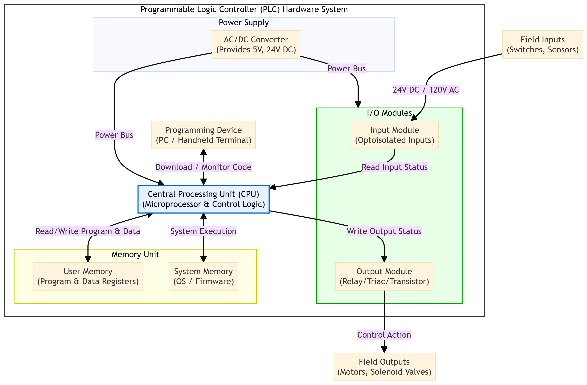
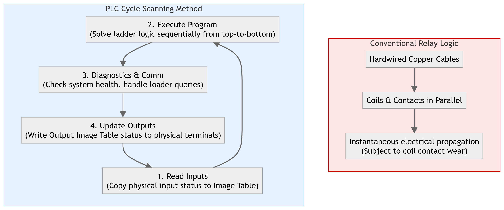
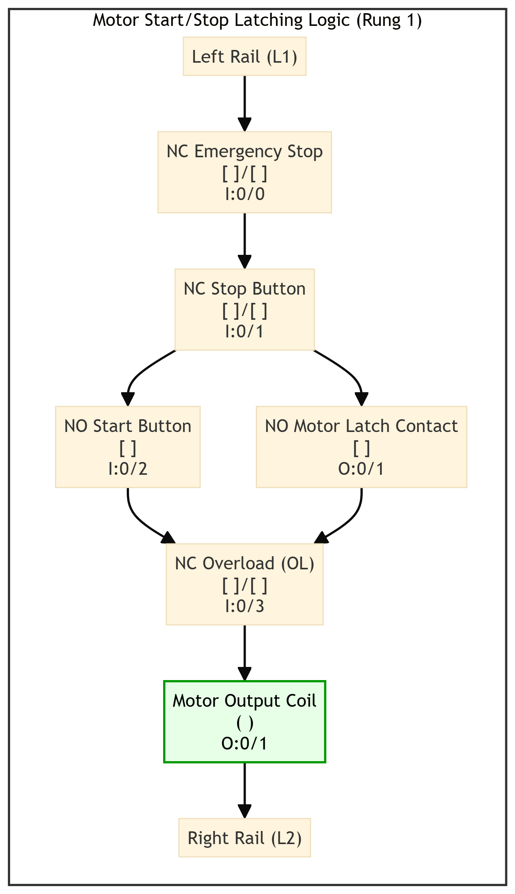
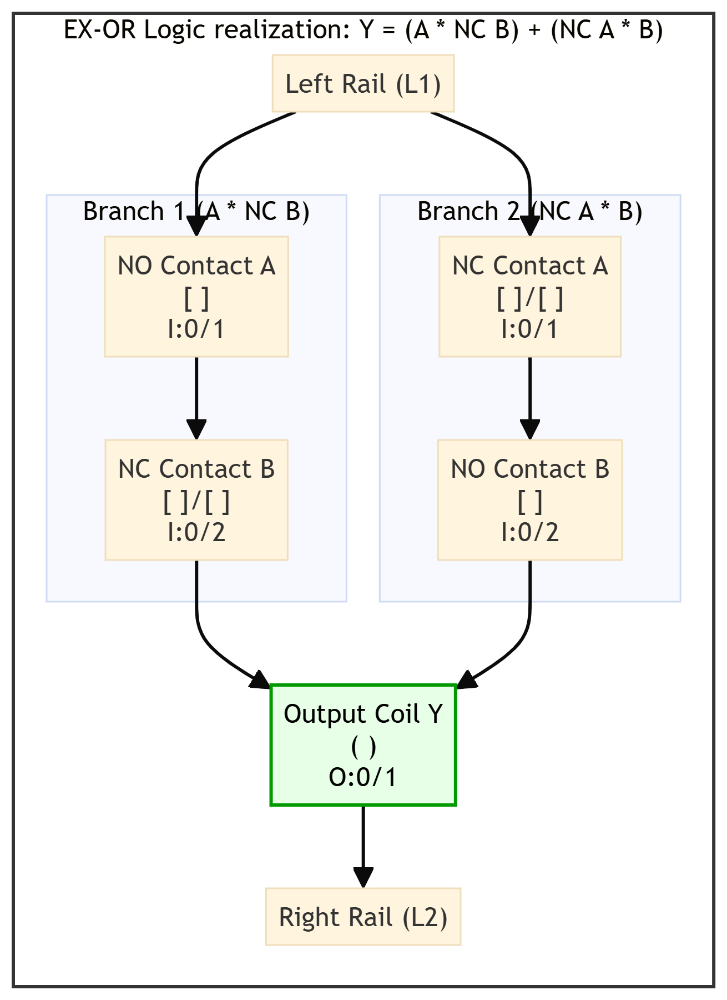
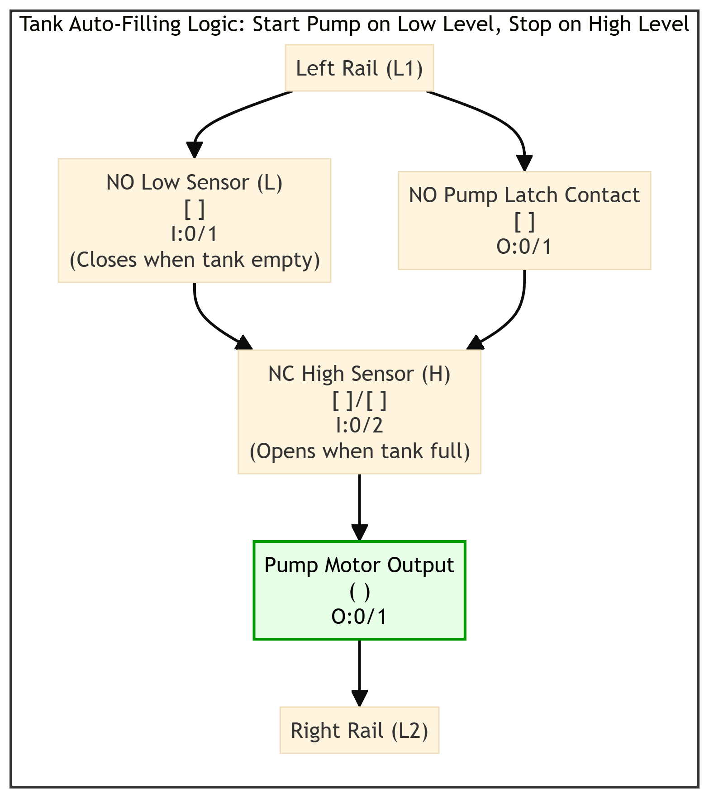
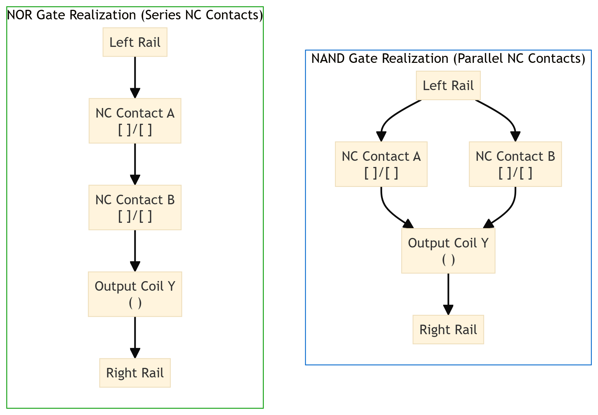
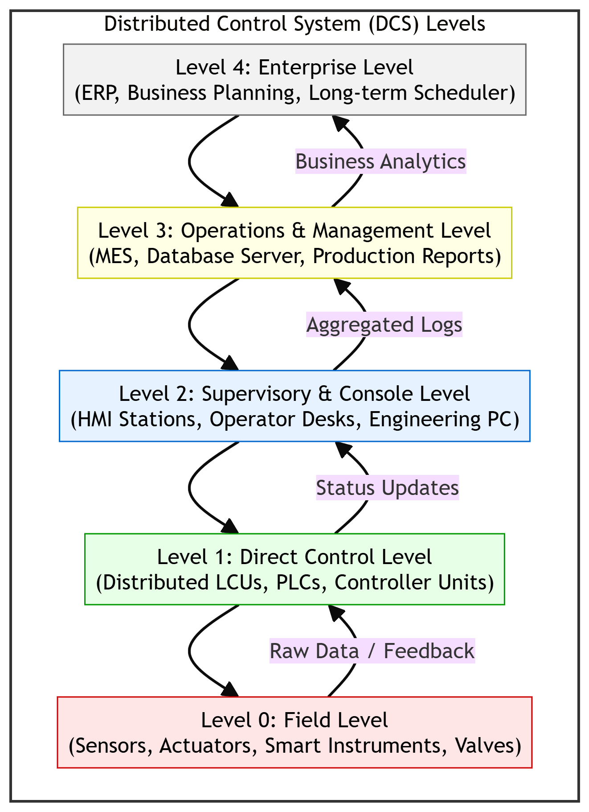
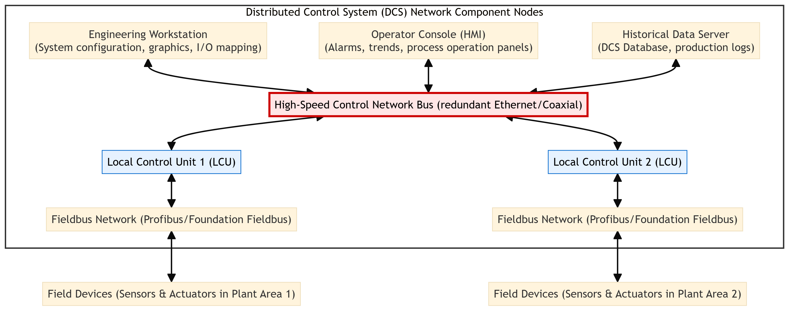
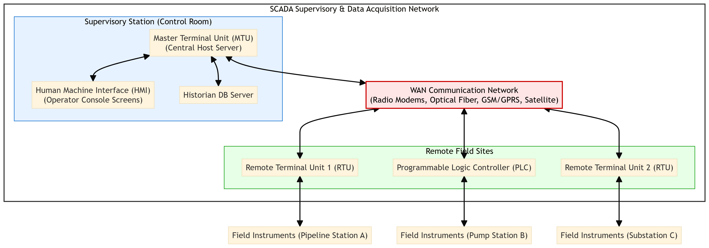
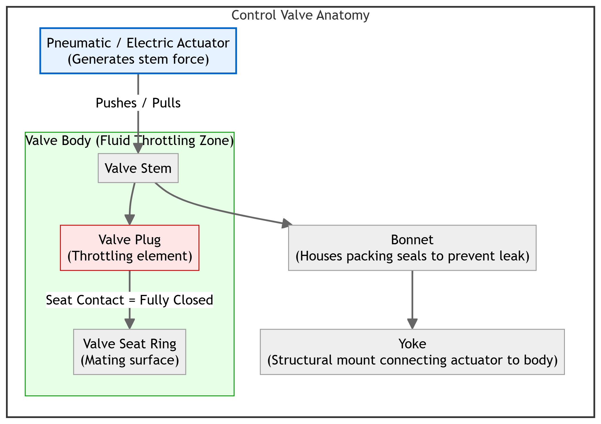

# Chapter 3: Automation Systems (PLC, DCS, SCADA)

This chapter compiles lecture-quality study notes and comprehensive exam answers for **Unit III: Automation Systems** of the PE-EC802B syllabus, adhering strictly to the **MAKAUT Answer Writing Guidelines** and **LaTeX Compatibility Rules**.

---

## Section 1: Programmable Logic Controllers (PLC) [15M] [Priority: High]

### 1. Definition and Architecture
A **Programmable Logic Controller (PLC)** is a solid-state, industrial computer designed to monitor inputs from field devices, execute custom control programs (such as logic, sequencing, timing, and arithmetic), and adjust output devices to automate manufacturing processes in harsh environments.



#### Core Architecture Components:
- **Central Processing Unit (CPU):** The brain of the PLC. It reads physical input states, solves the user program sequentially, performs system diagnostics, and updates physical outputs.
- **Memory Unit:**
  - *System Memory:* Stores the operating system, communication protocols, and execution firmware.
  - *User Memory:* Holds the compiled ladder logic program and data tables (input/output status tables, timer/counter presets, and register values).
- **Power Supply:** Converts industrial AC voltage ($120\text{--}240\ \text{V}$) or high DC voltage ($24\ \text{V}$) into the regulated low-voltage DC ($5\ \text{V}$) required to power the internal CPU and memory chips.
- **I/O Modules:** The physical interface to field equipment:
  - *Input Modules:* Convert raw signals from field sensors (e.g., switches, limit sensors) into logic-level signals. They use **optocouplers** to provide galvanic isolation, protecting the CPU from electrical surges.
  - *Output Modules:* Convert low-power CPU decisions into industrial signals (using Relays for AC/DC switching, Triacs for AC loads, or Transistors for high-speed DC switching) to control actuators (e.g., motors, solenoid valves).
- **Programming Device:** A PC running dedicated software used to write, simulate, debug, and download the control logic to the CPU.

---

### 2. PLC vs. Conventional Electromagnetic Relay Control Panels
Before PLCs, industrial automation relied on hardwired cabinets filled with electromagnetic relays, timers, and counters.

| Feature / Criteria | Hardwired Relay Panels | Programmable Logic Controllers (PLC) |
| :--- | :--- | :--- |
| **Logic Modification** | Requires rewiring, physically running copper cables, and adding relays. | Modified via software on a PC; no physical wiring changes needed. |
| **Footprint & Space** | Massive; cabinets occupy significant floor space. | Compact; a single PLC replaces hundreds of physical relays. |
| **Troubleshooting** | Extremely difficult; requires checking thousands of wire terminals manually. | Simple; PC screen displays active current flow (highlighted rungs) and faults. |
| **Reliability** | Low; mechanical relay contacts wear out, pit, and collect dust. | High; solid-state electronics with no moving parts. |
| **Response Time** | Slow ($10\text{--}50\ \text{ms}$) due to physical armature movement. | Fast ($1\text{--}10\ \text{ms}$) solid-state execution cycle. |
| **Cost** | High wiring labor cost and maintenance downtime. | Low lifetime cost; high initial hardware cost offset by flexibility. |



---

### 3. IEC 61131-3 PLC Programming Languages
The international standard IEC 61131-3 defines five standard programming languages for PLCs:

1. **Ladder Diagram (LD):** A graphical language that mimics electrical schematic diagrams. It uses two vertical rails (power and return) and horizontal rungs containing contact switches (NO/NC) and coils, making it highly intuitive for electricians.
2. **Function Block Diagram (FBD):** A graphical language where logic is represented as interconnected blocks containing pre-programmed functions (such as PID, gates, timers). It is popular in process control.
3. **Structured Text (ST):** A high-level, text-based programming language similar to Pascal or C. It is used for complex calculations, array loops, and data manipulation.
4. **Instruction List (IL):** A low-level, assembly-like textual language. It is fast-executing but harder to read and maintain.
5. **Sequential Function Chart (SFC):** A graphical language used to program sequential, multi-step processes. It breaks the logic into steps, transitions, and actions.

---

### 4. PLC Ladder Logic Designs
Standard Ladder Diagram (LD) structures use standard contacts: Normally Open (NO: `[ ]`), Normally Closed (NC: `[ ]/[ ]`), and Output Coils (`( )`).

#### A. Motor Start/Stop Latching Control
- **Application:** A standard latching (or sealing) circuit allows a momentary push-button to start a motor, which remains running until a stop button is pressed or an overload fault occurs.
- **Circuit Operation:**
  - *Emergency Stop (NC)* and *Stop (NC)* are placed in series at the start of the rung. Their contacts remain closed under normal conditions.
  - *Start (NO)* is placed in series with the *Overload Contact (NC)* and the *Motor Coil (O:0/1)*.
  - *Motor Latch Contact (NO)* (addressed to the Motor Coil `O:0/1`) is placed in parallel with the *Start (NO)* contact.
  - Pressing the *Start* button completes the circuit, energizing the *Motor Coil*.
  - When the *Motor Coil* energizes, its auxiliary contact *Motor Latch (NO)* closes. This maintains current flow to the coil even after the *Start* button is released.
  - Pressing the *Stop* button or an *Overload* trip opens the series line, de-energizing the coil and opening the latch.



#### B. EX-OR Logic Gate Realization
- **Application:** Realizes the output $Y = A \oplus B = A\bar{B} + \bar{A}B$.
- **Circuit Operation:**
  - *Rung Branch 1:* NO contact $A$ in series with NC contact $B$.
  - *Rung Branch 2 (in parallel):* NC contact $A$ in series with NO contact $B$.
  - Both branches lead to the common output coil $Y$.
  - Output $Y$ is energized if and only if one of the inputs ($A$ or $B$) is active, but not both.



#### C. Liquid Tank Level Control System
- **Application:** Turn ON the filling pump motor when the liquid level falls to a low-level sensor ($L$), and keep it running until the level reaches a high-level sensor ($H$).
- **Circuit Operation:**
  - *Low Sensor L (NO):* Configured to close when the level drops below $L$.
  - *High Sensor H (NC):* Configured to open when the level reaches $H$.
  - When the level falls below $L$, *Low Sensor L* closes, completing the path through the NC *High Sensor H* and energizing the *Pump Coil*.
  - The auxiliary contact *Pump Latch (NO)* closes, sealing the pump output in parallel with *Low Sensor L*.
  - As the tank fills, the level rises above $L$, opening the *Low Sensor L* contact, but the pump remains energized through the latch.
  - When the level reaches $H$, the *High Sensor H (NC)* contact opens, breaking the circuit, de-energizing the pump, and resetting the latch.



#### D. NAND and NOR Logic Gates
- **NAND Gate ($Y = \overline{A \cdot B} = \bar{A} + \bar{B}$):** Realized by placing NC contact $A$ and NC contact $B$ in parallel. Current flows to the coil if either $A$ is inactive or $B$ is inactive (only cutting power if both are active).
- **NOR Gate ($Y = \overline{A + B} = \bar{A} \cdot \bar{B}$):** Realized by placing NC contact $A$ and NC contact $B$ in series. Current flows to the coil only if both $A$ and $B$ are inactive.



---

## Section 2: Distributed Control Systems (DCS) [15M] [Priority: High]

### 1. Definition and Importance
A **Distributed Control System (DCS)** is a computerized control system for a large-scale manufacturing plant or continuous process, where autonomous controllers (Local Control Units - LCUs) are distributed throughout the system. The entire system is linked by a high-speed communication network, offering centralized monitoring and engineering management.

#### Importance in Process Control:
- **No Single Point of Failure:** Because control is distributed among multiple LCUs, a failure in one unit only affects its local plant loop, while the rest of the plant continues operating.
- **Scalability:** Easy to expand by adding new LCUs and Operator Stations to the existing system network.
- **Sophisticated Database & Redundancy:** DCS controllers feature redundant CPUs, power supplies, and network paths to ensure high availability ($99.99\%$).

---

### 2. DCS Hierarchical Levels
Industrial automation systems are structured hierarchically into levels as defined by the ISA-95 standard:

- **Level 4: Enterprise Level:** Houses the Enterprise Resource Planning (ERP) database system. It handles corporate-wide logistics, financial decisions, and long-term production scheduling.
- **Level 3: Operations & Management Level:** Manages the Manufacturing Execution System (MES). It oversees plant-wide production scheduling, quality control, maintenance tracking, and database archiving (DCS Historian).
- **Level 2: Supervisory & Console Level:** The interface for operators (HMI consoles) and engineers. It displays real-time process flows, manages alarms, records historical trends, and hosts engineering configuration tools.
- **Level 1: Direct Control Level:** Houses the distributed controllers (LCUs) and local PLCs. These units execute PID control algorithms, check safety interlocks, and calculate analog/digital outputs.
- **Level 0: Field Level:** Comprises physical field instruments (sensors for temperature, pressure, flow) and final control elements (valves, pumps, actuators).



---

### 3. DCS Architecture
A standard DCS consists of discrete hardware modules connected via high-speed, redundant network paths.



- **Local Control Unit (LCU):** The controller node. It contains a CPU, memory, and local I/O cards to interface with sensors and actuators. It runs the local control algorithms (e.g., PID loops, interlocks).
- **Operator Station (HMI):** Graphic consoles that provide operators with real-time displays of the plant status, alarm lists, trend charts, and manual overrides.
- **Engineering Station:** A dedicated PC used to configure control strategies, design HMI graphics, map I/O registers, and push updates to the LCUs.
- **Historical Data Server:** A high-capacity database node that archives process logs, alarm histories, and system events for analysis.
- **High-Speed System Bus:** A redundant, high-bandwidth network (e.g., Industrial Ethernet, token ring) that carries data between the LCUs, operator stations, and servers.
- **Fieldbus Network:** The local network link (e.g., Profibus, Foundation Fieldbus) connecting smart field instruments directly to the LCU's digital ports.

---

### 4. DCS Types and Applications
DCS installations vary based on network architecture and system scope:
- **Traditional Proprietary DCS:** Uses custom, manufacturer-specific hardware, operating systems, and network buses (e.g., Honeywell TDC3000). Highly secure and stable, but expensive and difficult to integrate with third-party components.
- **Open DCS:** Built on standard PC hardware, standard operating systems (Windows/Linux), and open network standards (TCP/IP, Ethernet). Offers lower costs and easy integration, but requires careful cybersecurity management.
- **Application Example:**
  - *Petrochemical Refineries:* Managing hundreds of continuous temperature, pressure, and distillation fraction control loops across wide chemical process units.

---

## Section 3: Supervisory Control & Data Acquisition (SCADA) [15M] [Priority: High]

### 1. Definition and Significance
**SCADA** stands for **Supervisory Control and Data Acquisition**. It is a software-hardware system designed to collect real-time data from remote field locations and provide supervisory control over wide geographic distances (telemetry).

#### Significance of SCADA:
While a DCS is optimized for high-density, continuous analog control within a single localized facility (e.g., a refinery), SCADA is optimized for monitoring and controlling assets spread across hundreds of kilometers (e.g., oil pipelines, water networks, electricity grids).

---

### 2. SCADA System Components
A standard SCADA system contains five main components:

- **Master Terminal Unit (MTU):** The central server located at the control headquarters. It sends command queries to remote field stations, stores the centralized database, runs system diagnostics, and hosts the SCADA software.
- **Remote Terminal Unit (RTU):** A rugged, micro-controller-based device deployed at remote field sites. It gathers local sensor data, converts it to digital telemetry formats, transmits it to the MTU, and executes received MTU control commands.
- **Programmable Logic Controllers (PLCs):** Often deployed alongside or in place of RTUs. PLCs excel at fast, localized discrete logic control, while the RTU handles wide-area communication protocols.
- **Communication WAN:** The telemetry medium linking the MTU to the RTUs (e.g., VHF/UHF radio networks, cellular GPRS/4G links, dial-up telephone networks, satellite links, or fiber optic cables).
- **HMI Console:** Operator display PC screens showing geographical maps, alarms, valve controls, and streaming process variables.



---

### 3. SCADA Applications
SCADA is widely used in critical infrastructure systems:
- **Electrical Grid Distribution:** Monitoring substation breakers, transformer temperatures, and power line voltage swings across a province.
- **Water & Sewage Networks:** Tracking tank levels, water flow rates, and starting water pumps located at remote wells and reservoir basins.
- **Oil and Gas Pipelines:** Monitoring pressure spikes, flow volumes, and controlling emergency shut-off valves along cross-country pipe pipelines.

---

## Section 4: Control Valves & Field Accessories [5M] [Priority: Medium]

---

### 1. Control Valve Anatomy
A **control valve** is the final control element in a liquid or gas process control loop. It adjusts the fluid flow rate by varying the opening size of the flow path based on a controller output signal.



#### Core Components:
- **Actuator:** The drive mechanism that converts the control signal (pneumatic air pressure or electric voltage) into linear or rotary motion to move the valve stem.
- **Yoke:** A metal bracket that securely mounts the actuator housing to the valve body bonnet.
- **Stem:** A polished metal rod that connects the internal valve plug to the external actuator piston. It transmits the actuator displacement.
- **Bonnet:** The top cap of the valve body. It houses the **packing box** (sealing material like Teflon or graphite) to prevent process fluid from leaking along the moving stem.
- **Valve Plug:** The movable throttling element inside the valve body. Its position relative to the seat determines the flow area.
- **Valve Seat Ring:** The stationary ring fixed inside the valve body. When the valve plug is fully pressed against the seat, the flow path is completely blocked.
- **Valve Body:** The outer pressure vessel shell that contains the internal plug and seat, managing the fluid flow path.

---

### 2. Close and Open States
- **Fully Closed State:** When the actuator pushes the stem until the valve plug is in full contact with the **valve seat ring**. This blocks all fluid flow.
- **Fully Open State:** When the actuator retracts the stem, lifting the valve plug to its maximum distance from the valve seat ring, allowing maximum flow.
- **Throttling State:** Operating at intermediate positions between fully open and fully closed to maintain a specific process flow rate.

---

### 3. Globe Valves
A **globe valve** is a linear-motion control valve commonly used for throttling flow control.
- **Operation:** It has a spherical body shape with an internal baffle partition. The flow path is forced to turn $90^\circ$ twice as it passes through the orifice. A plug on the end of a linear stem is lowered or raised to restrict or permit flow.
- **Application:** Globe valves are ideal for throttling pressure and flow control because they offer precise flow control and can withstand high differential pressures, though they introduce a significant pressure drop across the valve.

---

## Section 5: PLC Performance, Noise Immunity, and Instruction Sets (Q3.5) [5M][★★★★]

High-reliability industrial operation requires an understanding of how PLCs manage CPU timing, survive harsh electric noise environments, and execute basic timer logic.

---

### 1. PLC Scan Time
The **Scan Time** of a PLC is the total amount of time required for the CPU to execute one complete cycle of the operating program. This cycle is performed continuously and sequentially.

```text
       ┌────────────────────────┐
       │      1. Input Scan     │◄────────┐
       │ (Reads field switches, │         │
       │  updates memory table) │         │
       └───────────┬────────────┘         │
                   │                      │
                   ▼                      │
       ┌────────────────────────┐         │
       │   2. Program Scan      │         │
       │ (Executes logic rungs  │         │
       │  sequentially in RAM)  │         │
       └───────────┬────────────┘         │
                   │                      │ Scan Cycle
                   ▼                      │ Repeats
       ┌────────────────────────┐         │
       │     3. Output Scan     │         │
       │ (Writes memory states  │         │
       │  to physical relays)   │         │
       └───────────┬────────────┘         │
                   │                      │
                   ▼                      │
       ┌────────────────────────┐         │
       │  4. Housekeeping/Comm  │         │
       │  (Self-diagnostics &   │─────────┘
       │  HMI communication)    │
       └────────────────────────┘
```

#### Steps of the PLC Scan Cycle:
1.  **Input Scan:** The CPU reads the ON/OFF states of all physical input modules (e.g., push buttons, sensors) and copies these values into a dedicated memory sector called the **Input Image Table**.
2.  **Program execution (Logic Scan):** The CPU reads the ladder logic program sequentially from top to bottom (rung by rung, left to right). It resolves all contacts using the states stored in the Input Image Table and writes the updated output states to the **Output Image Table**.
3.  **Output Scan:** The CPU copies the states from the Output Image Table directly to the physical output hardware modules to energize or de-energize external actuators (e.g., solenoids, contactors).
4.  **Housekeeping & Communications:** The CPU checks its internal hardware for diagnostics, updates its internal timers, and handles communications with programming PCs or HMI consoles.

---

### 2. PLC Noise Immunity
Industrial plants are filled with **Radio Frequency Interference (RFI)**, electromagnetic fields (EMI), and voltage spikes from high-power switches. PLCs offer **excellent noise immunity** compared to standard microcontrollers or old relay setups through several hardware-based design choices:

1.  **Optical Isolation (Galvanic Isolation):** Physical inputs and outputs are isolated from the CPU using **optocouplers**. The incoming electrical signal drives an internal LED. The light travels across an air gap to a phototransistor, converting the signal back to low-voltage CPU logic. There is no physical electrical connection, preventing high-voltage spikes (surges up to $5\ \text{kV}$) from frying the processor.
2.  **Input Filtering Circuits:** Every input channel features an RC low-pass filter to block high-frequency electromagnetic noise spikes and filter out switch contact bounce.
3.  **Faraday Caging & Shielding:** PLCs are enclosed in heavy-duty grounded metal or high-impact plastic enclosures to block electrostatic fields. Internal buses are shielded to prevent cross-talk.
4.  **Reliability Comparison:**
    *   **Conventional Relay Panels:** High mechanical noise, contact arcing, and pitting.
    *   **Microcontrollers / PCs:** Poor noise immunity; high susceptibility to electrostatic discharges (ESD) and line ripples which trigger system resets or data corruption.
    *   **PLCs:** Excellent immunity, designed to withstand continuous industrial environment hazards.

---

### 3. Timer On Delay (TON) Instruction
The **Timer On Delay (TON)** is a standard PLC instruction used to delay turning on an output. When the input rung preceding the TON block transitions from False to True, the timer begins accumulating time.

```text
       Timer On Delay (TON)
       ┌──────────────────────────┐
       │ Timer:             T4:0  │
       │ Time Base:         1.0s  │
       │ Preset (PRE):      10    │
       │ Accumulator (ACC):  0    │
       └──────────────────────────┘
```

#### Core Parameters:
*   **Timer Address:** The memory register identifier (e.g., `T4:0`).
*   **Time Base:** The resolution of the timer, typically $0.01\ \text{s}$, $0.1\ \text{s}$, or $1.0\ \text{s}$.
*   **Preset Value (PRE):** The target delay time.
*   **Accumulator Value (ACC):** The elapsed time counted so far.
*   **Control Bits:**
    1.  **Enable Bit (EN):** Set to $1$ as long as the input rung is active (True).
    2.  **Timer Timing Bit (TT):** Set to $1$ while the timer is actively counting ($ACC < PRE$ and $EN = 1$).
    3.  **Done Bit (DN):** Set to $1$ when $ACC \ge PRE$. This bit is used as a contact to trigger the delayed physical output.

#### State Transitions:
*   **Rung goes True:** EN becomes $1$, TT becomes $1$, and ACC increments every time base interval.
*   **ACC reaches PRE:** TT drops to $0$ and DN becomes $1$. The connected output device turns ON.
*   **Rung goes False:** EN, TT, and DN immediately drop to $0$. The ACC resets back to $0$ (this is a non-retentive behavior).

---

### 4. Major Industrial PLC Manufacturers
To design and install systems, engineers choose PLCs from established hardware vendors:
*   **Siemens (Germany):** Standard-setter in Europe; famous for the Simatic S7 series (S7-1200, S7-1500) and TIA Portal software.
*   **Allen-Bradley / Rockwell Automation (USA):** Market leader in North America; famous for ControlLogix, CompactLogix, and RSLogix/Studio 5000 software.
*   **Mitsubishi Electric (Japan):** Dominant in Asian manufacturing; famous for the MELSEC series (FX, Q-series).
*   **ABB (Switzerland):** Widely used in process automation and power grid systems; famous for the AC500 and AC800M controllers.
*   **Schneider Electric (France):** Renowned for its Modicon line (the original creators of the PLC).

*(Note: **Microsoft** is a software/operating system developer and does **not** manufacture industrial PLCs).*

