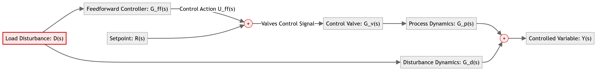
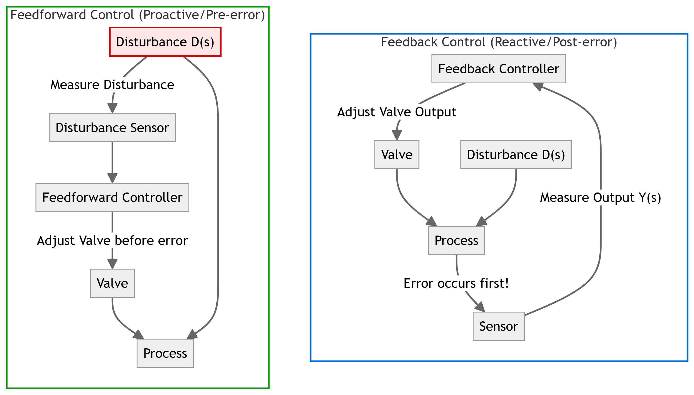
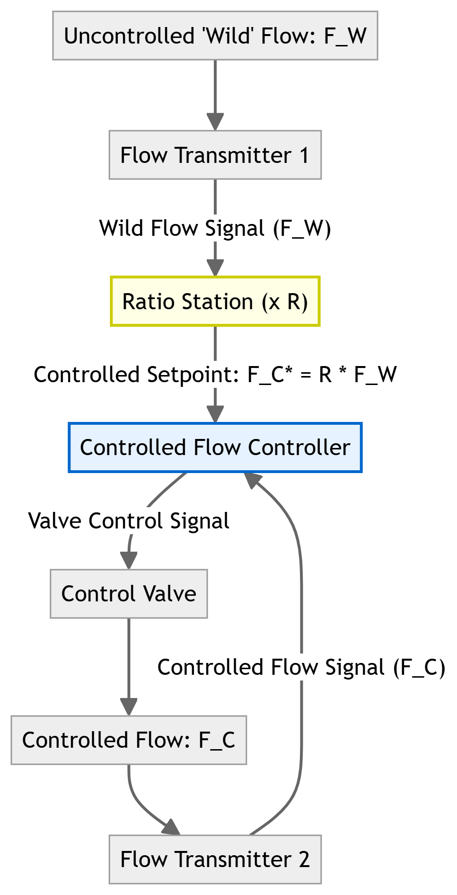
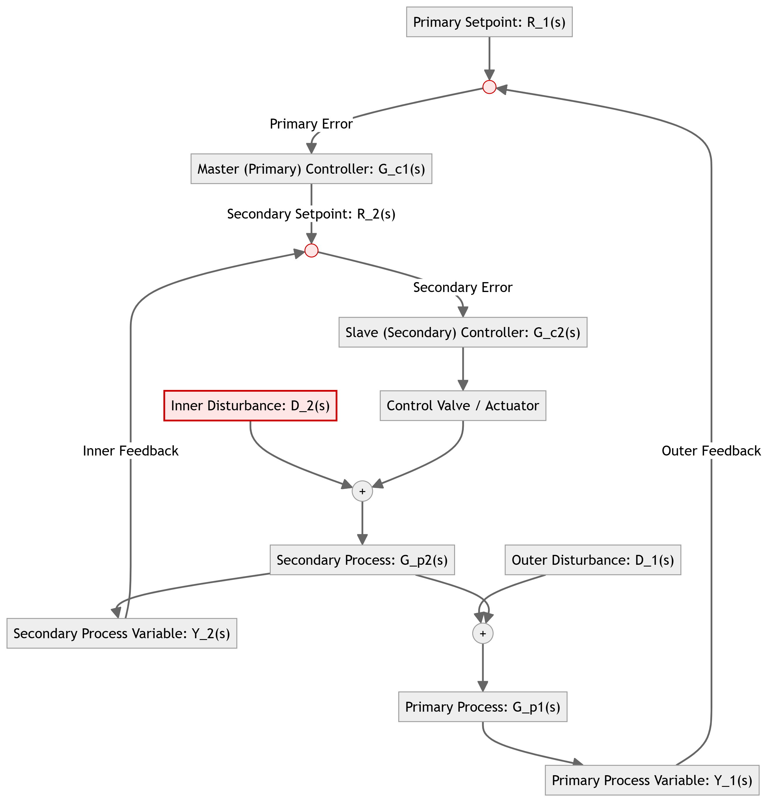
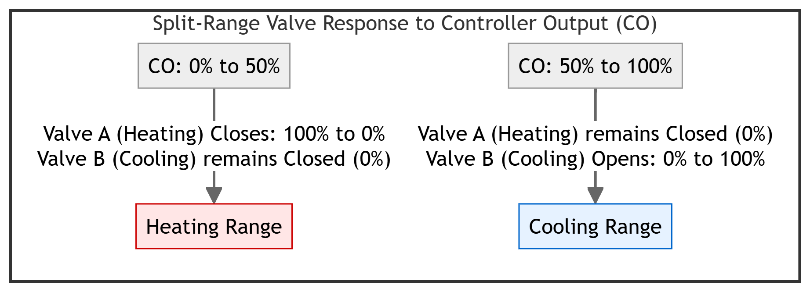
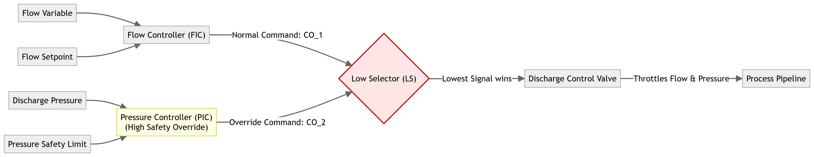
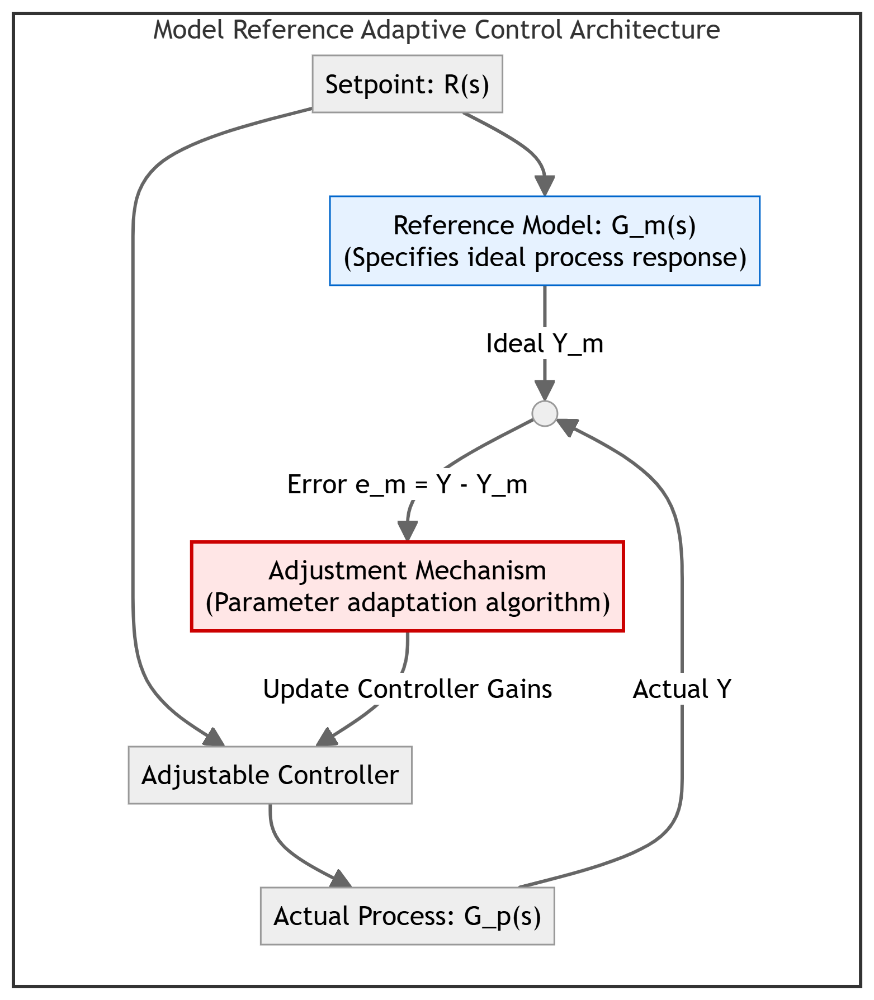
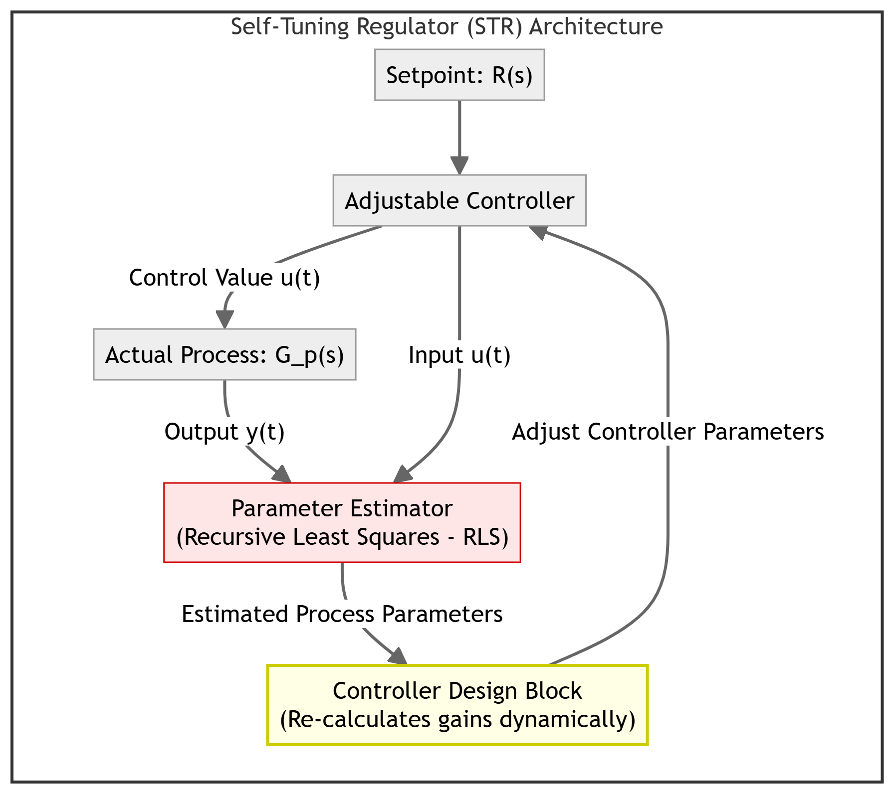
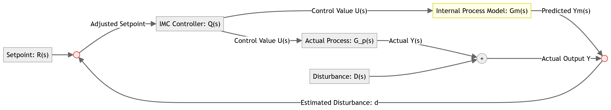

# Chapter 4: Advanced Control Techniques

This chapter compiles lecture-quality study notes and comprehensive exam answers for **Unit IV: Advanced Control Techniques** of the PE-EC802B syllabus, adhering strictly to the **MAKAUT Answer Writing Guidelines** and **LaTeX Compatibility Rules**.

---

## Section 1: Feedforward & Ratio Control [15M] [Priority: High]

### 1. Feedforward Control System
A **feedforward control system** is an anticipatory control strategy where disturbances are measured and corrected for before they have a chance to affect the controlled process variable.

#### A. Mathematical Derivation of Feedforward Controller
Consider the block diagram of the process system. The controlled output $Y(s)$ is affected by both the control action $U(s)$ and the load disturbance $D(s)$:
$$Y(s) = G_p(s) G_v(s) U(s) + G_d(s) D(s)$$
where:
- $G_p(s)$: Process dynamics transfer function.
- $G_v(s)$: Control valve transfer function.
- $G_d(s)$: Disturbance dynamics transfer function.

The feedforward controller $G_{ff}(s)$ measures the disturbance $D(s)$ and generates the control signal $U_{ff}(s) = G_{ff}(s) D(s)$.
For perfect control, we want to maintain the output at zero deviation ($Y(s) = 0$) despite changes in $D(s)$:
$$G_p(s) G_v(s) [G_{ff}(s) D(s)] + G_d(s) D(s) = 0$$

Dividing by $D(s)$:
$$G_p(s) G_v(s) G_{ff}(s) + G_d(s) = 0$$

Solving for the ideal Feedforward Controller Transfer Function $G_{ff}(s)$:
$$G_{ff}(s) = -\frac{G_d(s)}{G_v(s) G_p(s)}$$

*(Note: The negative sign indicates that the controller must apply a corrective action in the opposite direction of the disturbance deflection).*

#### B. Feedback vs. Feedforward Control Comparison

| Feature / Criteria | Feedback Control | Feedforward Control |
| :--- | :--- | :--- |
| **Operating Principle** | Reactive; acts only after a deviation in the output occurs. | Proactive; acts before a deviation in the output occurs. |
| **Measurement Parameter** | Measures the controlled variable ($Y(s)$). | Measures the load disturbance ($D(s)$). |
| **Stability** | Can cause instability and oscillations if tuned aggressively. | Inherently stable because it does not introduce a feedback loop. |
| **Process Knowledge** | Requires minimal process model knowledge. | Requires an accurate mathematical model of the process. |
| **Disturbance Rejection** | Rejects all disturbances, both known and unknown. | Rejects only the specific, measured disturbances. |

#### C. Heat Exchanger Case Study
In an industrial shell-and-tube heat exchanger, process fluid is heated by steam.
- **Goal:** Maintain process fluid outlet temperature at setpoint.
- **Load Disturbances:** Inlet process fluid flow rate, inlet process fluid temperature, and steam pressure variations.
- **FF Control Action:** A sensor measures the inlet flow rate (disturbance). If the flow rate increases, the feedforward controller immediately opens the steam control valve to supply more heat before the outlet temperature has a chance to drop.

---

### 2. Ratio Control System
A **ratio control system** is a specialized feedforward control loop used to maintain a constant ratio between two process flow streams.

#### A. Wild Flow vs. Controlled Flow
- **Wild Flow ($F_W$):** The primary stream flow rate. It is determined by upstream plant conditions and cannot be adjusted by the ratio controller.
- **Controlled Flow ($F_C$):** The secondary stream flow rate. Its control valve is adjusted by the controller to maintain the desired ratio:
  $$R = \frac{F_C}{F_W}$$

#### B. Multiplier vs. Divider Schemes
- **Multiplier Scheme (Recommended):**
  The wild flow $F_W$ is measured and multiplied by the desired ratio $R$ to calculate the setpoint for the controlled flow loop ($F_C^* = R \times F_W$).
- **Divider Scheme:**
  Both flows are measured, and their ratio is calculated ($R_{act} = F_C / F_W$) and compared to the setpoint ratio $R$.
  - *Disadvantage:* If the wild flow drops to zero ($F_W = 0$), the division results in a divide-by-zero error, causing controller saturation and loop instability. Therefore, the **multiplier scheme** is preferred.

- **Application Example:**
  - *Fuel-Air Ratio Control:* Maintaining the exact stoichiometric ratio of air and fuel entering a combustion furnace to ensure efficient combustion and reduce emissions.

---

## Section 2: Cascade Control System [15M] [Priority: High]

### 1. Definition and Operating Principle
A **cascade control system** consists of two nested feedback loops: a **primary (outer) loop** and a **secondary (inner) loop**. The primary controller (Master) monitors the main controlled variable and calculates a control output, which serves as the setpoint for the secondary controller (Slave). The slave controller directly adjusts the final control valve.

#### Operating Principle:
- **Inner (Slave) Loop:** Deployed close to the source of the disturbance (e.g., fuel header pressure). It is designed to be fast-acting.
- **Outer (Master) Loop:** Monitors the primary slow process variable (e.g., furnace temperature). It calculates the setpoint for the inner loop.
- If a pressure spike occurs in the fuel line, the slave loop detects the change and corrects the valve position immediately, before the primary process temperature is affected.

---

### 2. Advantages of Cascade Control
- **Fast Disturbance Rejection:** Rejects secondary disturbances within the inner loop before they can propagate and affect the primary process variable.
- **Reduced Phase Lag:** Breaking a multi-capacity process into two smaller loops reduces the overall phase lag, allowing higher controller gains and faster response.
- **Linearization:** The inner loop linearizes the valve characteristics and compensates for actuator non-linearities like hysteresis and stiction.

---

## Section 3: Special Loop Architectures (Split-Range & Override) [15M] [Priority: High]

---

### 1. Split-Range (Duplex) Control
**Split-range control** is a loop configuration where a single controller output (CO) is split to control two or more final control elements (valves) acting in sequence.

#### A. Working Principle
The controller output range ($0\text{--}100\%$) is split into sub-ranges for each valve:
- **Valve A (Heating Valve - Air-to-Open):**
  - At $0\%$ CO: Fully Open ($3\ \text{psi}$ signal).
  - At $50\%$ CO: Fully Closed ($9\ \text{psi}$ signal).
  - At $50\text{--}100\%$ CO: Remains Closed.
- **Valve B (Cooling Valve - Air-to-Close):**
  - At $0\text{--}50\%$ CO: Remains Closed ($9\ \text{psi}$ signal).
  - At $50\%$ CO: Fully Closed.
  - At $100\%$ CO: Fully Open ($15\ \text{psi}$ signal).

#### B. Industrial Example
- **Chemical Jacketed Reactor:**
  To control reactor temperature, a single PID controller adjusts both steam (heating) and cooling water (cooling) valves. From $0\text{--}50\%$ CO, the steam valve closes. From $50\text{--}100\%$ CO, the cooling valve opens. This ensures both valves are never open at the same time, preventing energy waste.

---

### 2. Override (Selective) Control
**Override (selective) control** is a protective control strategy where two or more controllers share a single control valve through a selector block (High Selector or Low Selector).

#### A. Working Principle & Safety Protection
- Under normal operating conditions, the primary controller (e.g., Flow Controller) maintains the process variable at the setpoint.
- If a secondary variable (e.g., discharge pressure or motor current) exceeds a safety threshold, the safety override controller activates.
- The **Low Selector (LS)** or **High Selector (HS)** compares the controller outputs and routes the safer signal to the valve:
  - *Low Selector:* Passes the lowest controller output. Used to limit high pressures or flows.
  - *High Selector:* Passes the highest controller output. Used to maintain minimum flow to prevent pump damage.

#### B. Necessity
- Prevents equipment damage (e.g., pipeline overpressure or pump cavitation).
- Avoids plant shutdowns by temporarily throttling the process instead of tripping the system.

---

## Section 4: Advanced Adaptive & Model-Based Control [15M] [Priority: High]

---

### 1. Adaptive Control
An **adaptive controller** automatically adjusts its tuning gains ($K_c, \tau_I, \tau_D$) in real-time to compensate for changes in process dynamics, non-linearities, or environmental conditions.

| Feature / Criteria | Model Reference Adaptive Control (MRAC) | Self-Tuning Regulators (STR) |
| :--- | :--- | :--- |
| **Operating Loop** | Uses an explicit reference model in parallel. | Identifies process parameters online using recursive estimation. |
| **Parameter Update** | Updates controller parameters based on model tracking error. | Updates controller parameters by solving design equations. |
| **Complexity** | Simpler calculation loop; relies on direct gradient rules. | Highly complex; requires online parameter estimation. |
| **Response Speed** | Fast adaptation to transient path deviations. | Slower adaptation due to parameter identification lag. |

#### A. Model Reference Adaptive Control (MRAC)
An ideal reference model defines the desired response of the closed-loop system to a setpoint change. The adjustment mechanism compares the actual process output ($Y$) with the model output ($Y_m$) and updates the controller gains using adaptation algorithms (e.g., MIT rule) to drive the error to zero.

#### B. Self-Tuning Regulators (STR)
An STR contains an online parameter estimator that continuously identifies the process parameters (e.g., using Recursive Least Squares - RLS). A controller design block uses these estimated parameters to calculate new controller gains (e.g., using pole placement) and updates the controller.

---

### 2. Internal Model Control (IMC)
**Internal Model Control (IMC)** is a model-based control strategy where an explicit mathematical model of the process is run in parallel with the physical process.

#### A. Working Principle
- The controller output is sent to both the physical process $G_p(s)$ and the process model $\tilde{G}_p(s)$.
- The predicted model output ($\tilde{Y}$) is subtracted from the actual measured process output ($Y$). This difference represents the unmodeled disturbances and model mismatch ($d = Y - \tilde{Y}$).
- This difference is fed back to the setpoint summing junction.
- **Advantage:** If the model matches the process exactly ($\tilde{G}_p = G_p$) and there are no disturbances, the feedback signal is zero, and the control loop operates in an open-loop fashion, improving system stability. The IMC structure also simplifies the design of controllers for processes with dead time.
